# Networking

## Overview

AWS Networking enables secure communication between AWS resources and external networks. The foundation of AWS networking is the **Amazon Virtual Private Cloud (VPC)**, which allows you to create an isolated virtual network where you can launch AWS resources.

A typical AWS network consists of:

- Amazon VPC
- Subnets
- Route Tables
- Internet Gateway (IGW)
- NAT Gateway
- Security Groups
- Network ACLs (NACLs)
- Elastic Network Interfaces (ENIs)

> **Interview Tip**
>
> AWS Networking is one of the **most frequently asked interview topics**. Be prepared to explain:
>
> - Public vs Private Subnet
> - Internet Gateway vs NAT Gateway
> - Security Group vs Network ACL
> - VPC Architecture
> - Route Tables

---

## Why It Is Used

AWS Networking is used to:

- Isolate cloud resources
- Secure applications
- Connect applications to the Internet
- Control network traffic
- Enable private communication
- Connect on-premises networks to AWS
- Build highly available applications

---

## Architecture / Working

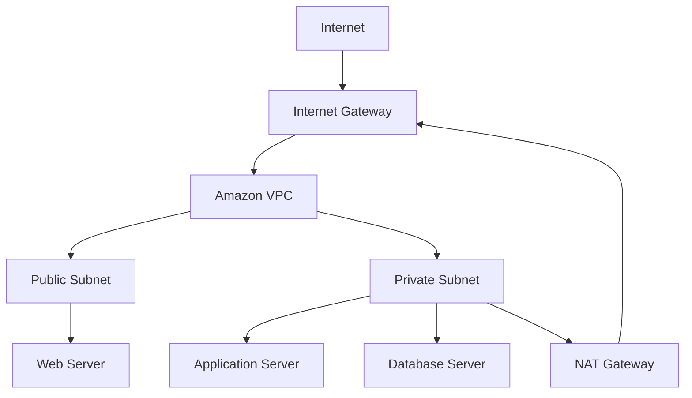

---

## Key Components

| Component | Purpose |
|-----------|----------|
| Amazon VPC | Private virtual network |
| Subnet | Logical network segment |
| Route Table | Controls traffic routing |
| Internet Gateway | Internet access |
| NAT Gateway | Outbound internet for private subnet |
| Security Group | Instance-level firewall |
| Network ACL | Subnet-level firewall |
| ENI | Virtual network adapter |

---

## Types (if applicable)

| Component | Types |
|-----------|-------|
| Subnet | Public, Private |
| Route | Local, Internet, NAT |
| Firewall | Security Group, NACL |

---

## Lifecycle / Workflow

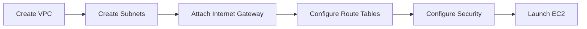

---

## Configuration / Syntax (if applicable)

Typical VPC setup:

1. Create VPC
2. Create Public Subnet
3. Create Private Subnet
4. Create Internet Gateway
5. Attach Internet Gateway
6. Create Route Tables
7. Configure NAT Gateway
8. Configure Security Groups
9. Launch EC2

---

## Important Commands (if applicable)

```bash
aws ec2 describe-vpcs

aws ec2 describe-subnets

aws ec2 describe-route-tables

aws ec2 describe-security-groups

aws ec2 describe-network-acls
```

---

## Important Files (if applicable)

None.

---

## Real-World Use Cases

- Multi-tier web applications
- Private databases
- Kubernetes clusters
- Hybrid cloud networking
- Secure enterprise workloads

---

## Advantages

- Network isolation
- Secure communication
- Flexible routing
- High availability
- Fine-grained traffic control

---

## Limitations

- Complex routing configurations
- Misconfigured rules may block traffic
- NAT Gateway incurs additional cost

---

## Common Interview Questions (Concept Only)

- What is Amazon VPC?
- Difference between Public and Private Subnet?
- Internet Gateway vs NAT Gateway?
- Security Group vs NACL?
- What is an ENI?
- Can a Private Subnet access the Internet?
- Can an Internet Gateway be attached to multiple VPCs?
- What is Local Route?

---

## Common Mistakes

- Forgetting Route Table configuration
- Opening Security Groups to the Internet
- Missing NAT Gateway for Private Subnets
- Blocking traffic with NACLs
- Launching private resources into public subnets

---

## Troubleshooting

| Problem | Solution |
|----------|----------|
| EC2 cannot access Internet | Verify IGW and Route Table |
| Private EC2 cannot download packages | Verify NAT Gateway |
| SSH not working | Check Security Group and Route Table |
| Resources cannot communicate | Verify VPC CIDR and routing |
| Traffic blocked | Review Security Groups and NACLs |

---

## Summary

AWS Networking provides secure, scalable, and isolated networking using Amazon VPC, Subnets, Route Tables, Internet Gateways, NAT Gateways, Security Groups, Network ACLs, and ENIs.

---

# Amazon VPC

## Overview

Amazon Virtual Private Cloud (VPC) is a logically isolated virtual network where AWS resources are launched.

Each VPC has its own:

- IP address range (CIDR)
- Route Tables
- Subnets
- Security configuration

---

## Why It Is Used

- Network isolation
- Secure communication
- Custom networking

---

## Architecture / Working

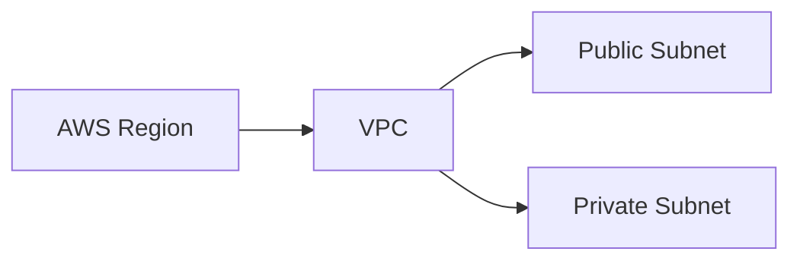

---

## Key Components

- CIDR Block
- Subnets
- Route Tables
- Gateways

---

## Types (if applicable)

- Default VPC
- Custom VPC

---

## Lifecycle / Workflow


---

## Configuration / Syntax (if applicable)

Example CIDR:

```
10.0.0.0/16
```

---

## Important Commands (if applicable)

```bash
aws ec2 describe-vpcs
```

---

## Important Files (if applicable)

None.

---

## Real-World Use Cases

- Enterprise applications
- Production workloads

---

## Advantages

- Isolation
- Security

---

## Limitations

- CIDR cannot be reduced after creation

---

## Common Interview Questions (Concept Only)

- What is a VPC?
- Difference between Default and Custom VPC?

---

## Common Mistakes

- Overlapping CIDRs

---

## Troubleshooting

Verify CIDR configuration.

---

## Summary

A VPC provides an isolated virtual network in AWS.

---

# Subnets

## Overview

A Subnet is a subdivision of a VPC.

Resources launched inside a subnet share the same routing configuration.

---

## Why It Is Used

- Organize resources
- Improve security
- Separate workloads

---

## Architecture / Working

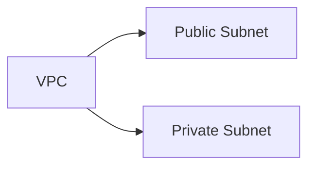

---

## Key Components

- CIDR
- Availability Zone

---

## Types (if applicable)

| Type | Description |
|------|-------------|
| Public | Internet accessible |
| Private | No direct internet access |

---

## Lifecycle / Workflow

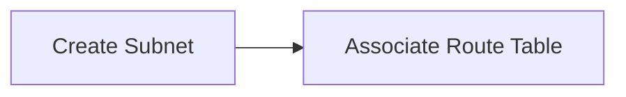

---

## Configuration / Syntax (if applicable)

Example:

```
10.0.1.0/24
```

---

## Important Commands (if applicable)

```bash
aws ec2 describe-subnets
```

---

## Important Files (if applicable)

None.

---

## Real-World Use Cases

- Public web servers
- Private databases

---

## Advantages

- Better organization

---

## Limitations

- Subnet belongs to one Availability Zone

---

## Common Interview Questions (Concept Only)

- Difference between Public and Private Subnet?

---

## Common Mistakes

- Wrong Route Table association

---

## Troubleshooting

Verify subnet route association.

---

## Summary

Subnets divide a VPC into smaller network segments.

---

# Route Tables

## Overview

Route Tables determine how network traffic leaves a subnet.

Every subnet must be associated with one Route Table.

---

## Why It Is Used

- Route traffic
- Enable internet connectivity
- Connect AWS resources

---

## Architecture / Working


---

## Key Components

- Destination
- Target

---

## Types (if applicable)

- Main Route Table
- Custom Route Table

---

## Lifecycle / Workflow


---

## Configuration / Syntax (if applicable)

Example route:

```
0.0.0.0/0 → Internet Gateway
```

---

## Important Commands (if applicable)

```bash
aws ec2 describe-route-tables
```

---

## Important Files (if applicable)

None.

---

## Real-World Use Cases

- Internet routing
- Private networking

---

## Advantages

- Flexible routing

---

## Limitations

- Incorrect routes cause connectivity issues

---

## Common Interview Questions (Concept Only)

- What is a Route Table?

---

## Common Mistakes

- Missing default route

---

## Troubleshooting

Verify destination and target.

---

## Summary

Route Tables determine packet routing inside a VPC.

---

# Internet Gateway

## Overview

An Internet Gateway (IGW) allows communication between a VPC and the Internet.

---

## Why It Is Used

- Internet connectivity
- Public applications

---

## Architecture / Working

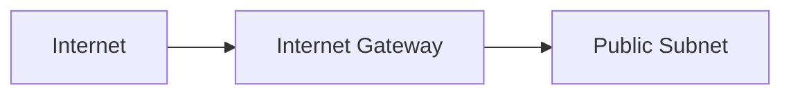

---

## Key Components

- Attached to VPC

---

## Types (if applicable)

- One IGW per VPC

---

## Lifecycle / Workflow

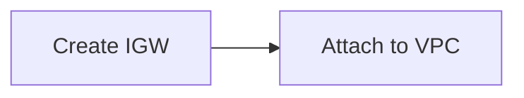

---

## Configuration / Syntax (if applicable)

Requires Route Table entry.

---

## Important Commands (if applicable)

```bash
aws ec2 describe-internet-gateways
```

---

## Important Files (if applicable)

None.

---

## Real-World Use Cases

- Public web servers

---

## Advantages

- Internet access

---

## Limitations

- Public subnet only

---

## Common Interview Questions (Concept Only)

- What is Internet Gateway?

---

## Common Mistakes

- Forgetting Route Table configuration

---

## Troubleshooting

Verify IGW attachment.

---

## Summary

Internet Gateway enables internet connectivity for public subnets.

---

# NAT Gateway

## Overview

A NAT Gateway allows resources in private subnets to access the Internet without exposing them to inbound internet traffic.

---

## Why It Is Used

- Package updates
- Download software
- Secure outbound internet access

---

## Architecture / Working

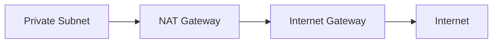

---

## Key Components

- Elastic IP
- Public Subnet

---

## Types (if applicable)

- Managed NAT Gateway

---

## Lifecycle / Workflow

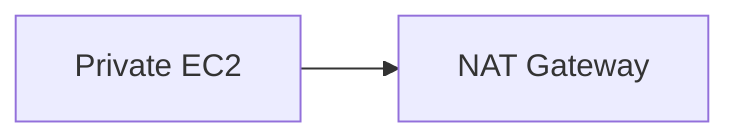

---

## Configuration / Syntax (if applicable)

NAT Gateway must be placed in a Public Subnet.

---

## Important Commands (if applicable)

```bash
aws ec2 describe-nat-gateways
```

---

## Important Files (if applicable)

None.

---

## Real-World Use Cases

- Application servers
- Kubernetes worker nodes

---

## Advantages

- Secure outbound internet

---

## Limitations

- Additional cost

---

## Common Interview Questions (Concept Only)

- Internet Gateway vs NAT Gateway?

---

## Common Mistakes

- Creating NAT in a Private Subnet

---

## Troubleshooting

Verify Elastic IP and Route Table.

---

## Summary

NAT Gateway enables outbound internet access for private resources.

---

# Security Groups

## Overview

Security Groups are stateful virtual firewalls attached to EC2 instances.

---

## Why It Is Used

- Protect EC2
- Filter network traffic

---

## Architecture / Working

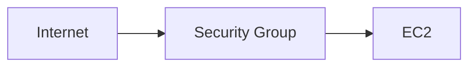

---

## Key Components

- Inbound Rules
- Outbound Rules

---

## Types (if applicable)

- Stateful firewall

---

## Lifecycle / Workflow

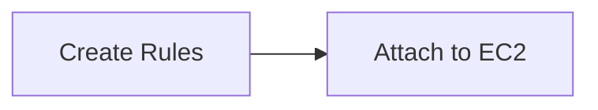

---

## Configuration / Syntax (if applicable)

Allow rules only.

---

## Important Commands (if applicable)

```bash
aws ec2 describe-security-groups
```

---

## Important Files (if applicable)

None.

---

## Real-World Use Cases

- SSH
- HTTP
- HTTPS

---

## Advantages

- Stateful
- Easy management

---

## Limitations

- Cannot explicitly deny traffic

---

## Common Interview Questions (Concept Only)

- What is a Security Group?

---

## Common Mistakes

- Opening SSH to `0.0.0.0/0`

---

## Troubleshooting

Review inbound rules.

---

## Summary

Security Groups provide instance-level firewall protection.

---

# Network ACLs (NACLs)

## Overview

Network ACLs are stateless firewalls applied at the subnet level.

---

## Why It Is Used

- Additional network security
- Block unwanted traffic

---

## Architecture / Working

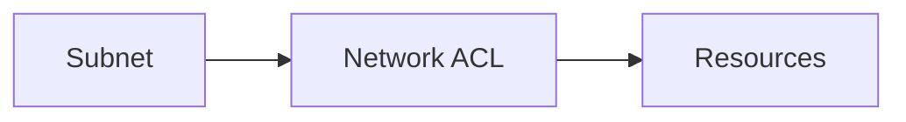

---

## Key Components

- Inbound Rules
- Outbound Rules

---

## Types (if applicable)

- Stateless firewall

---

## Lifecycle / Workflow


---

## Configuration / Syntax (if applicable)

Supports Allow and Deny.

---

## Important Commands (if applicable)

```bash
aws ec2 describe-network-acls
```

---

## Important Files (if applicable)

None.

---

## Real-World Use Cases

- Subnet protection

---

## Advantages

- Supports Deny rules

---

## Limitations

- Stateless

---

## Common Interview Questions (Concept Only)

- Security Group vs NACL?

---

## Common Mistakes

- Forgetting return traffic rules

---

## Troubleshooting

Review inbound and outbound rules.

---

## Summary

Network ACLs secure traffic at the subnet level.

---

# Elastic Network Interface (ENI)

## Overview

An Elastic Network Interface (ENI) is a virtual network card attached to an EC2 instance.

---

## Why It Is Used

- Multiple IP addresses
- Multiple network interfaces
- Failover

---

## Architecture / Working

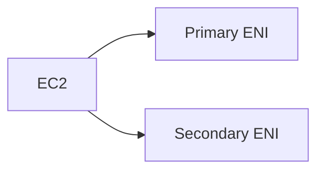

---

## Key Components

- Private IP
- Public IP
- Security Groups
- MAC Address

---

## Types (if applicable)

- Primary ENI
- Secondary ENI

---

## Lifecycle / Workflow

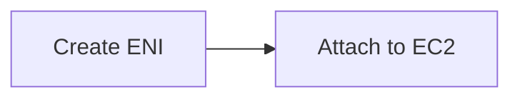

---

## Configuration / Syntax (if applicable)

Attach using AWS Console or CLI.

---

## Important Commands (if applicable)

```bash
aws ec2 describe-network-interfaces
```

---

## Important Files (if applicable)

None.

---

## Real-World Use Cases

- High availability
- Network appliances
- Multi-homed instances

---

## Advantages

- Flexible networking

---

## Limitations

- Instance type limits the number of ENIs

---

## Common Interview Questions (Concept Only)

- What is an ENI?
- Can an EC2 instance have multiple ENIs?

---

## Common Mistakes

- Exceeding ENI limits for the selected instance type

---

## Troubleshooting

Verify ENI attachment and associated Security Groups.

---

## Summary

ENIs provide virtual network interfaces that enable flexible networking configurations for EC2 instances.

---

# Interview Quick Revision

## AWS VPC Architecture

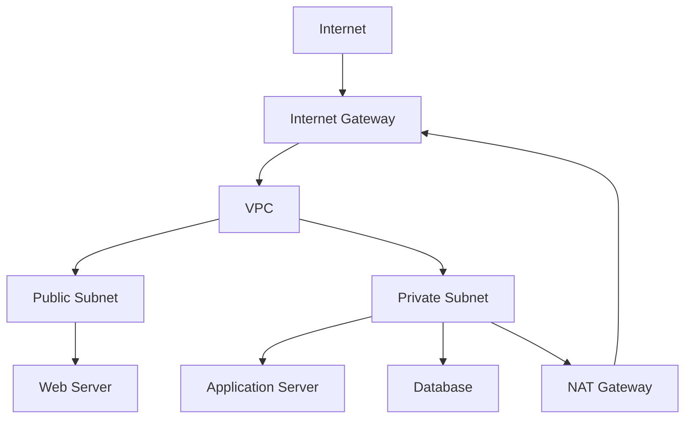

---

## Security Group vs Network ACL

| Feature | Security Group | Network ACL |
|----------|---------------|-------------|
| Level | Instance | Subnet |
| Stateful | ✅ Yes | ❌ No |
| Allow Rules | ✅ Yes | ✅ Yes |
| Deny Rules | ❌ No | ✅ Yes |
| Return Traffic | Automatically Allowed | Must Be Explicitly Allowed |

---

## Internet Gateway vs NAT Gateway

| Internet Gateway | NAT Gateway |
|------------------|-------------|
| Public Internet Access | Outbound Internet Only |
| Used by Public Subnets | Used by Private Subnets |
| No Elastic IP Required | Requires Elastic IP |
| Allows Inbound & Outbound Traffic | Allows Outbound Traffic Only |

---

## Public vs Private Subnet

| Public Subnet | Private Subnet |
|---------------|----------------|
| Has Route to Internet Gateway | No Direct Route to Internet Gateway |
| Can Host Public Resources | Hosts Internal Resources |
| Public IP Supported | Typically No Public IP |
| Internet Accessible | Uses NAT Gateway for Outbound Internet |

---

## AWS Networking Best Practices

- Use **Custom VPCs** for production environments.
- Separate workloads into **Public and Private Subnets**.
- Place databases and internal services in **Private Subnets**.
- Use **Internet Gateways** only for public-facing resources.
- Use **NAT Gateways** to provide secure outbound internet access for private resources.
- Apply the **principle of least privilege** to Security Groups.
- Use **Network ACLs** as an additional subnet-level security layer.
- Distribute subnets across multiple **Availability Zones** for high availability.
- Avoid overly permissive rules such as `0.0.0.0/0` unless absolutely required.
- Regularly review Route Tables, Security Groups, and NACLs for unnecessary access.

---

## One-line Interview Answer

**AWS Networking is built around Amazon VPC and provides secure, isolated, and scalable networking using Subnets, Route Tables, Internet Gateways, NAT Gateways, Security Groups, Network ACLs, and Elastic Network Interfaces to enable controlled communication between AWS resources and external networks.**
