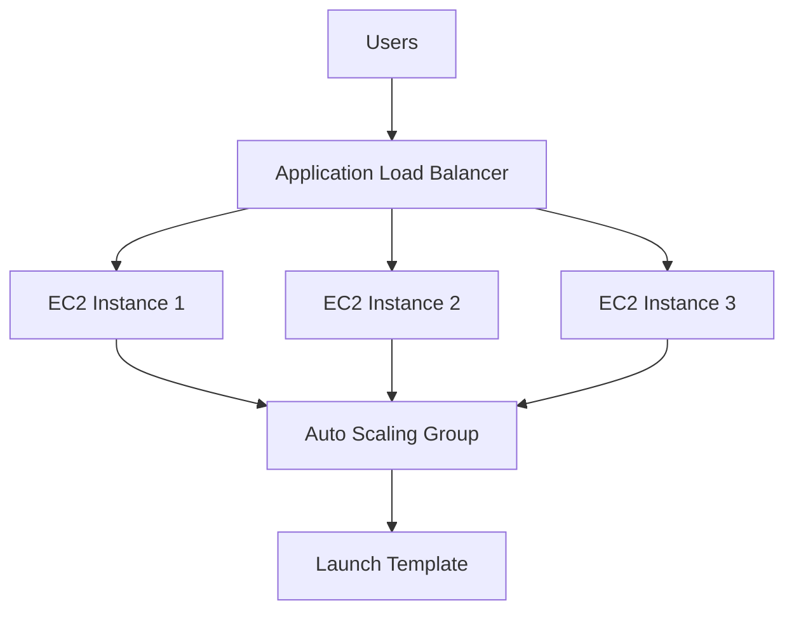
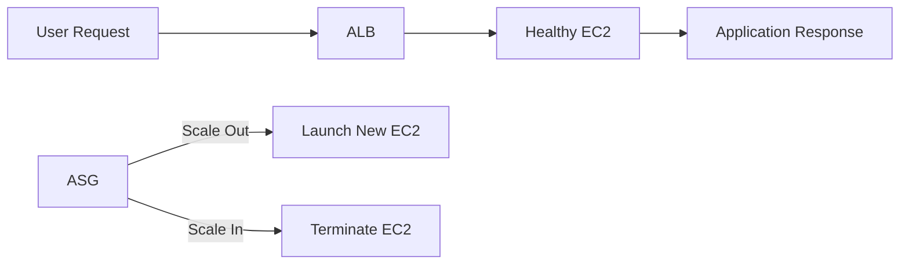
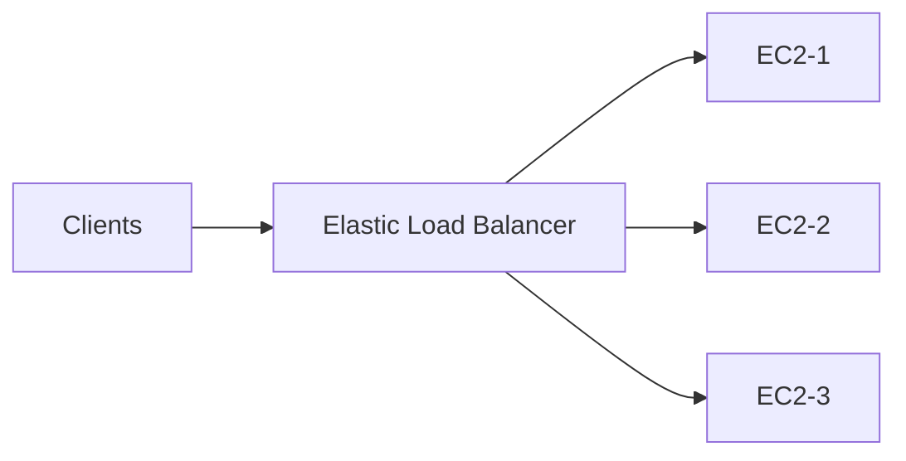
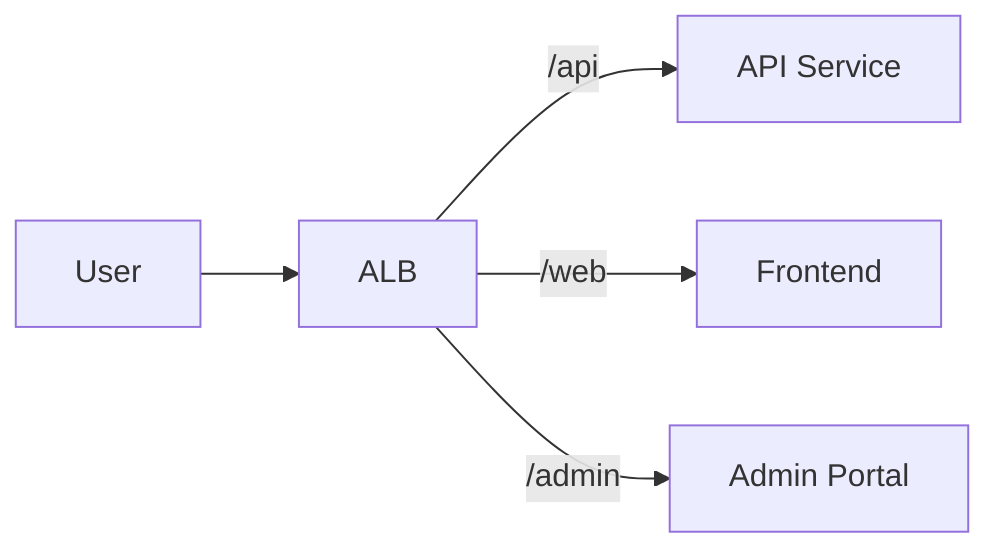
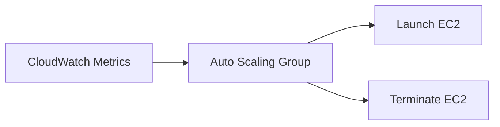
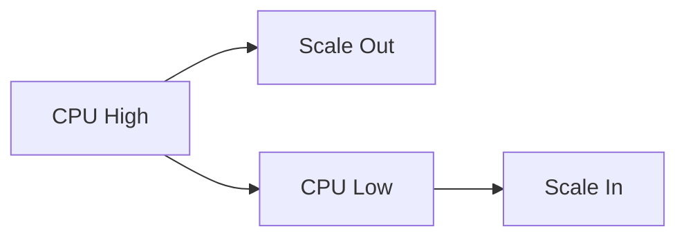
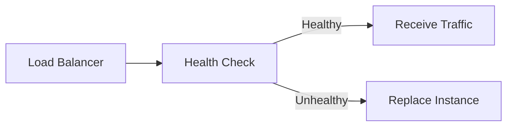
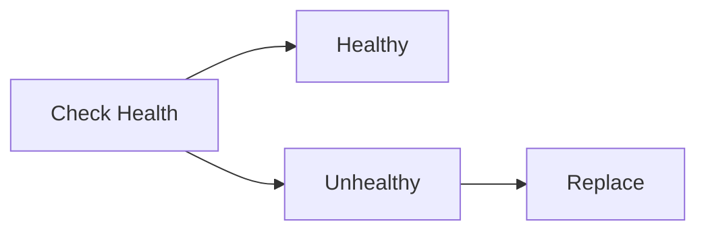
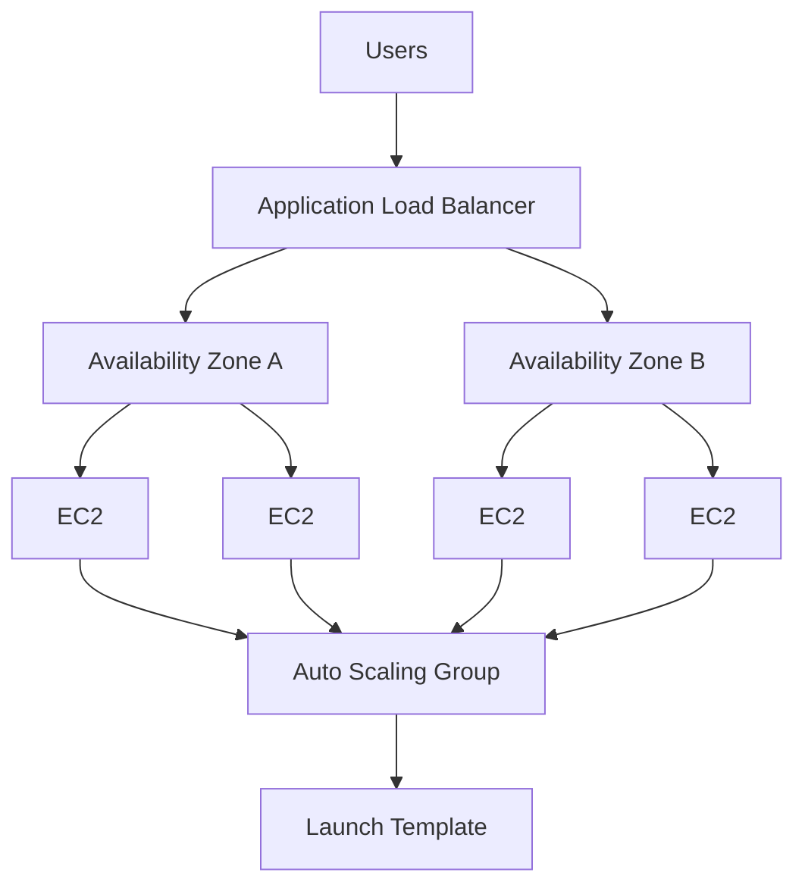

# Load Balancing & Auto Scaling

## Overview

AWS Load Balancing and Auto Scaling provide **high availability, fault tolerance, scalability, and automatic resource management** for applications.

The two core services are:

- **Elastic Load Balancing (ELB)** – Distributes incoming traffic across multiple EC2 instances.
- **Auto Scaling Groups (ASG)** – Automatically adds or removes EC2 instances based on demand.

Together, they ensure applications remain highly available while optimizing infrastructure costs.

> **Interview Tip**
>
> This is one of the **most frequently asked AWS interview topics**. Be comfortable explaining:
>
> - ELB vs ALB
> - ALB vs NLB (basic difference)
> - Auto Scaling Groups
> - Launch Templates
> - Health Checks
> - Scaling Policies

---

## Why It Is Used

AWS Load Balancing and Auto Scaling are used to:

- Improve application availability
- Distribute user traffic
- Prevent server overload
- Automatically scale infrastructure
- Reduce operational costs
- Eliminate single points of failure
- Support high-traffic applications

---

## Architecture / Working



---

## Key Components

| Component | Purpose |
|-----------|----------|
| Elastic Load Balancer | Distributes traffic |
| Application Load Balancer | Layer 7 Load Balancer |
| Auto Scaling Group | Automatically scales EC2 instances |
| Launch Template | EC2 launch configuration |
| Health Checks | Detect unhealthy instances |

---

## Types (if applicable)

| Service | Layer | Use Case |
|----------|--------|----------|
| ALB | Layer 7 | HTTP/HTTPS |
| NLB | Layer 4 | TCP/UDP |
| GWLB | Layer 3/4 | Network Appliances |

> **Interview Focus**
>
> ALB is the most commonly used load balancer in DevOps interviews.

---

## Lifecycle / Workflow



---

## Configuration / Syntax (if applicable)

Typical deployment:

1. Create Launch Template
2. Create Auto Scaling Group
3. Create Target Group
4. Create Load Balancer
5. Attach Target Group
6. Configure Health Checks
7. Configure Scaling Policies

---

## Important Commands (if applicable)

```bash
aws elbv2 describe-load-balancers

aws elbv2 describe-target-groups

aws autoscaling describe-auto-scaling-groups

aws ec2 describe-launch-templates
```

---

## Important Files (if applicable)

None.

---

## Real-World Use Cases

- Web applications
- E-commerce websites
- APIs
- Kubernetes worker nodes
- Jenkins HA
- Microservices
- Enterprise applications

---

## Advantages

- High availability
- Automatic scaling
- Fault tolerance
- Cost optimization
- Better performance
- Easy integration

---

## Limitations

- Additional cost
- Incorrect health checks may terminate healthy instances
- Poor scaling policies may cause excessive scaling

---

## Common Interview Questions (Concept Only)

- What is Elastic Load Balancing?
- What is the difference between ELB and ALB?
- What is Auto Scaling?
- What is a Launch Template?
- What are Health Checks?
- What happens when an instance becomes unhealthy?
- Difference between Scaling Out and Scaling Up?
- Can ALB route traffic based on URL?
- Can ASG launch instances automatically?

---

## Common Mistakes

- Incorrect health check path
- Opening Security Groups incorrectly
- Single Availability Zone deployment
- Missing Launch Template updates
- Improper scaling thresholds

---

## Troubleshooting

| Problem | Solution |
|----------|----------|
| Instance unhealthy | Verify health check endpoint |
| ALB not routing traffic | Check Target Group registration |
| Scaling not happening | Review CloudWatch metrics and scaling policy |
| Health checks failing | Verify application is running |
| New instances not launching | Verify Launch Template |

---

## Summary

Elastic Load Balancing distributes application traffic while Auto Scaling Groups automatically adjust EC2 capacity based on demand. Together they provide scalable, highly available, and fault-tolerant applications.

---

# Elastic Load Balancer (ELB)

## Overview

Elastic Load Balancer (ELB) automatically distributes incoming traffic across multiple targets such as EC2 instances, containers, or IP addresses.

ELB improves:

- Availability
- Scalability
- Fault tolerance

---

## Why It Is Used

- Prevent server overload
- High availability
- Traffic distribution
- Automatic failover

---

## Architecture / Working



---

## Key Components

- Listener
- Target Group
- Health Check
- Availability Zones

---

## Types (if applicable)

| Type | OSI Layer | Protocol |
|------|-----------|----------|
| ALB | Layer 7 | HTTP/HTTPS |
| NLB | Layer 4 | TCP/UDP |
| GWLB | Layer 3/4 | Network Appliances |

---

## Lifecycle / Workflow


---

## Configuration / Syntax (if applicable)

Requires:

- Target Group
- Listener
- Registered Targets

---

## Important Commands (if applicable)

```bash
aws elbv2 describe-load-balancers
```

---

## Important Files (if applicable)

None.

---

## Real-World Use Cases

- Web servers
- APIs
- Microservices

---

## Advantages

- High availability
- Automatic traffic distribution
- SSL termination

---

## Limitations

- Additional cost

---

## Common Interview Questions (Concept Only)

- What is ELB?
- Types of ELB?

---

## Common Mistakes

- Registering unhealthy targets

---

## Troubleshooting

Check Target Group health.

---

## Summary

ELB distributes traffic across healthy application instances.

---

# Application Load Balancer (ALB)

## Overview

Application Load Balancer (ALB) is a Layer 7 load balancer that routes HTTP and HTTPS traffic.

It supports:

- Path-based routing
- Host-based routing
- SSL termination
- WebSocket
- HTTP/2

---

## Why It Is Used

- Web applications
- REST APIs
- Microservices
- Kubernetes Ingress

---

## Architecture / Working



---

## Key Components

- Listener
- Listener Rules
- Target Group

---

## Types (if applicable)

Layer 7 Load Balancer

---

## Lifecycle / Workflow


---

## Configuration / Syntax (if applicable)

Supports:

- HTTP
- HTTPS

---

## Important Commands (if applicable)

```bash
aws elbv2 describe-target-groups
```

---

## Important Files (if applicable)

None.

---

## Real-World Use Cases

- Microservices
- Kubernetes Ingress
- REST APIs

---

## Advantages

- URL routing
- Host routing
- SSL support

---

## Limitations

- HTTP/HTTPS only

---

## Common Interview Questions (Concept Only)

- What is ALB?
- Difference between ALB and NLB?

---

## Common Mistakes

- Wrong listener rules

---

## Troubleshooting

Verify listener configuration.

---

## Summary

ALB intelligently routes HTTP requests based on application rules.

---

# Auto Scaling Groups (ASG)

## Overview

Auto Scaling Groups automatically increase or decrease the number of EC2 instances based on application demand.

ASG helps maintain:

- Availability
- Performance
- Cost efficiency

---

## Why It Is Used

- Handle traffic spikes
- Replace unhealthy instances
- Reduce costs

---

## Architecture / Working



---

## Key Components

- Desired Capacity
- Minimum Capacity
- Maximum Capacity
- Scaling Policies

---

## Types (if applicable)

- Dynamic Scaling
- Scheduled Scaling
- Predictive Scaling

---

## Lifecycle / Workflow



---

## Configuration / Syntax (if applicable)

Requires:

- Launch Template
- Scaling Policy

---

## Important Commands (if applicable)

```bash
aws autoscaling describe-auto-scaling-groups
```

---

## Important Files (if applicable)

None.

---

## Real-World Use Cases

- Web applications
- Seasonal workloads

---

## Advantages

- Automatic scaling
- Cost savings
- High availability

---

## Limitations

- Incorrect thresholds cause instability

---

## Common Interview Questions (Concept Only)

- What is ASG?
- Difference between Scale Out and Scale Up?

---

## Common Mistakes

- Incorrect minimum capacity

---

## Troubleshooting

Review CloudWatch alarms.

---

## Summary

ASG automatically adjusts EC2 capacity according to demand.

---

# Launch Templates

## Overview

Launch Templates define the configuration used to launch EC2 instances.

They replace the older Launch Configuration.

---

## Why It Is Used

- Standardized deployments
- Version management
- Automation

---

## Architecture / Working


---

## Key Components

- AMI
- Instance Type
- Security Group
- User Data
- IAM Role

---

## Types (if applicable)

- Template Versions

---

## Lifecycle / Workflow


---

## Configuration / Syntax (if applicable)

Contains:

- AMI
- Instance Type
- Key Pair
- Security Group

---

## Important Commands (if applicable)

```bash
aws ec2 describe-launch-templates
```

---

## Important Files (if applicable)

None.

---

## Real-World Use Cases

- Auto Scaling
- CI/CD

---

## Advantages

- Reusable
- Version controlled

---

## Limitations

- Requires updates for new AMIs

---

## Common Interview Questions (Concept Only)

- What is a Launch Template?

---

## Common Mistakes

- Using outdated AMIs

---

## Troubleshooting

Verify template version.

---

## Summary

Launch Templates standardize EC2 deployments.

---

# Health Checks

## Overview

Health Checks determine whether an EC2 instance is healthy and capable of serving application traffic.

Unhealthy instances are automatically removed from the load balancer and can be replaced by Auto Scaling.

---

## Why It Is Used

- Automatic recovery
- High availability
- Fault detection

---

## Architecture / Working



---

## Key Components

- Health Check Path
- Interval
- Timeout
- Healthy Threshold
- Unhealthy Threshold

---

## Types (if applicable)

| Type | Description |
|------|-------------|
| EC2 Health Check | Instance status |
| ELB Health Check | Application status |

---

## Lifecycle / Workflow



---

## Configuration / Syntax (if applicable)

Example:

```
Health Check Path

/health

/status
```

---

## Important Commands (if applicable)

```bash
aws elbv2 describe-target-health
```

---

## Important Files (if applicable)

None.

---

## Real-World Use Cases

- Web applications
- APIs
- Kubernetes

---

## Advantages

- Automatic failure detection
- High availability

---

## Limitations

- Incorrect health check configuration may mark healthy instances as unhealthy

---

## Common Interview Questions (Concept Only)

- What is a Health Check?
- Difference between ELB and EC2 Health Checks?

---

## Common Mistakes

- Using the wrong health check endpoint
- Health endpoint returning HTTP 500
- Long application startup time without adjusting health check settings

---

## Troubleshooting

- Verify application endpoint returns HTTP 200.
- Check Target Group health status.
- Review application logs.
- Verify Security Groups allow health check traffic.
- Ensure the application is listening on the configured port.

---

## Summary

Health Checks continuously monitor EC2 instances and automatically remove or replace unhealthy instances to maintain application availability.

---

# Interview Quick Revision

## High Availability Architecture



---

## ELB Types

| Type | Layer | Protocol | Common Use Case |
|------|------|-----------|-----------------|
| ALB | Layer 7 | HTTP/HTTPS | Web Applications, APIs |
| NLB | Layer 4 | TCP/UDP | High-performance applications |
| GWLB | Layer 3/4 | IP/TCP | Virtual firewalls and network appliances |

---

## ALB vs NLB

| ALB | NLB |
|------|------|
| Layer 7 | Layer 4 |
| HTTP/HTTPS | TCP/UDP |
| Path-based Routing | No |
| Host-based Routing | No |
| SSL Termination | Yes | Limited |
| Best for Web Applications | Best for High Throughput |

---

## Scaling Types

| Scaling Type | Description |
|--------------|-------------|
| Scale Out | Add more EC2 instances |
| Scale In | Remove EC2 instances |
| Scale Up | Increase instance size |
| Scale Down | Decrease instance size |

---

## EC2 Health Check vs ELB Health Check

| EC2 Health Check | ELB Health Check |
|------------------|------------------|
| Verifies VM status | Verifies application availability |
| Checks operating system | Checks application endpoint |
| AWS-managed | Configurable path (e.g., `/health`) |

---

## AWS Load Balancing & Auto Scaling Best Practices

- Deploy Load Balancers across **multiple Availability Zones**.
- Use **Application Load Balancer (ALB)** for HTTP/HTTPS workloads.
- Place EC2 instances in **Auto Scaling Groups** instead of managing them manually.
- Use **Launch Templates** instead of the deprecated Launch Configurations.
- Configure **health check endpoints** that return only application health.
- Enable **Elastic Load Balancer Health Checks** in Auto Scaling Groups.
- Use **CloudWatch metrics** for dynamic scaling policies.
- Set appropriate **minimum, desired, and maximum capacities**.
- Perform regular testing of Auto Scaling events.
- Avoid overly aggressive scaling policies to prevent scaling oscillation.

---

## One-line Interview Answer

**AWS Load Balancing and Auto Scaling work together to build highly available, fault-tolerant, and scalable applications by distributing incoming traffic using Elastic Load Balancers and automatically adjusting EC2 capacity through Auto Scaling Groups based on application demand.**
