# Databases

## Overview

AWS provides fully managed database services for both **relational (SQL)** and **NoSQL** workloads.

The two most commonly used database services are:

- **Amazon RDS** – Managed relational database service
- **Amazon DynamoDB** – Fully managed NoSQL key-value database

Amazon RDS automates common database administration tasks such as provisioning, backups, patching, monitoring, and high availability.

> **Interview Tip**
>
> AWS database questions almost always focus on:
>
> - RDS vs DynamoDB
> - Multi-AZ vs Read Replica
> - Automated Backups vs Snapshots
> - Supported RDS Engines

---

## Why It Is Used

AWS databases help organizations to:

- Store application data
- Reduce database administration
- Improve scalability
- Increase availability
- Enable disaster recovery
- Simplify backups
- Support production applications

---

## Architecture / Working

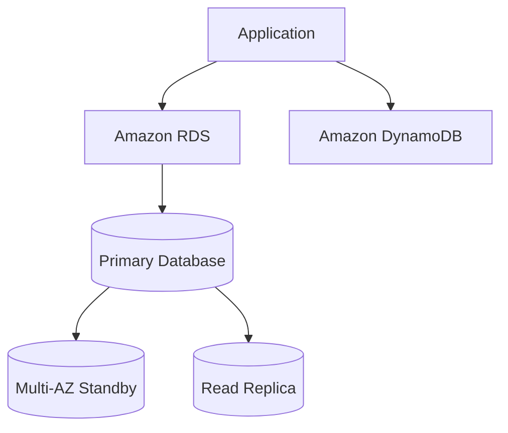

---

## Key Components

| Component | Purpose |
|-----------|----------|
| Amazon RDS | Managed relational database |
| RDS Engine | Database software |
| Multi-AZ | High Availability |
| Read Replica | Read Scaling |
| Automated Backup | Recovery |
| Snapshot | Manual backup |
| DynamoDB | Managed NoSQL database |

---

## Types (if applicable)

| Database Type | AWS Service |
|---------------|-------------|
| Relational | Amazon RDS |
| NoSQL | Amazon DynamoDB |

---

## Lifecycle / Workflow

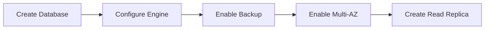

---

## Configuration / Syntax (if applicable)

Typical RDS deployment:

1. Select database engine
2. Choose instance class
3. Configure storage
4. Configure networking
5. Enable backups
6. Enable Multi-AZ
7. Launch database

---

## Important Commands (if applicable)

```bash
aws rds describe-db-instances

aws rds describe-db-snapshots

aws dynamodb list-tables
```

---

## Important Files (if applicable)

None.

---

## Real-World Use Cases

- Web applications
- ERP systems
- CRM applications
- E-commerce
- Mobile applications
- Analytics platforms

---

## Advantages

- Fully managed
- Automatic backups
- High availability
- Easy scaling
- Secure

---

## Limitations

- Some database administration tasks are restricted
- Multi-AZ increases cost
- Read Replicas are eventually consistent

---

## Common Interview Questions (Concept Only)

- What is Amazon RDS?
- What is Multi-AZ?
- What is Read Replica?
- Difference between Multi-AZ and Read Replica?
- What databases does RDS support?
- Difference between RDS and DynamoDB?
- What is Automated Backup?
- What is a Snapshot?

---

## Common Mistakes

- Using Read Replicas for High Availability
- Forgetting backup retention
- Disabling automatic backups
- Using Multi-AZ for read scaling

---

## Troubleshooting

| Problem | Solution |
|----------|----------|
| Database unavailable | Verify Multi-AZ status |
| Slow read performance | Use Read Replica |
| Restore failed | Verify backup retention |
| Connection timeout | Check Security Groups and Subnet Group |

---

## Summary

Amazon RDS and DynamoDB provide managed database solutions for relational and NoSQL workloads. RDS focuses on SQL databases with automated management, while DynamoDB delivers serverless, high-performance NoSQL storage.

---

# Amazon RDS

## Overview

Amazon Relational Database Service (RDS) is a fully managed service for relational databases.

AWS manages:

- Installation
- Patching
- Monitoring
- Backups
- Failover

You manage:

- Database schema
- Users
- Queries
- Applications

---

## Why It Is Used

- Reduce operational effort
- Managed SQL databases
- High availability
- Easy scaling

---

## Architecture / Working

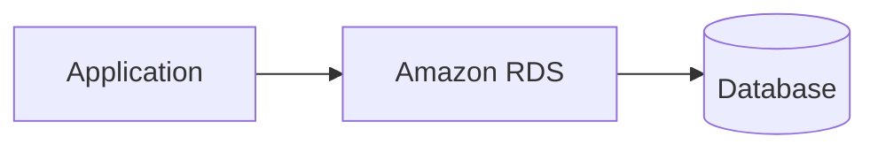

---

## Key Components

- Database Instance
- Storage
- Endpoint
- Security Group
- Parameter Group

---

## Types (if applicable)

- Single-AZ
- Multi-AZ

---

## Lifecycle / Workflow

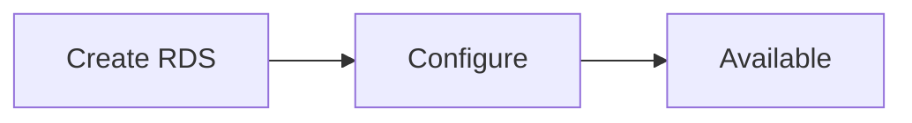

---

## Configuration / Syntax (if applicable)

Configured using AWS Console, CLI, SDK, Terraform, or CloudFormation.

---

## Important Commands (if applicable)

```bash
aws rds describe-db-instances
```

---

## Important Files (if applicable)

None.

---

## Real-World Use Cases

- ERP
- CRM
- Banking
- E-commerce

---

## Advantages

- Managed service
- Automatic patching
- Automatic backups

---

## Limitations

- Less OS-level control

---

## Common Interview Questions (Concept Only)

- What is Amazon RDS?
- Benefits of RDS?

---

## Common Mistakes

- Choosing incorrect instance size

---

## Troubleshooting

Verify database status.

---

## Summary

Amazon RDS simplifies relational database administration.

---

# RDS Engines

## Overview

Amazon RDS supports multiple relational database engines.

---

## Why It Is Used

Allows organizations to choose the most suitable database platform.

---

## Architecture / Working

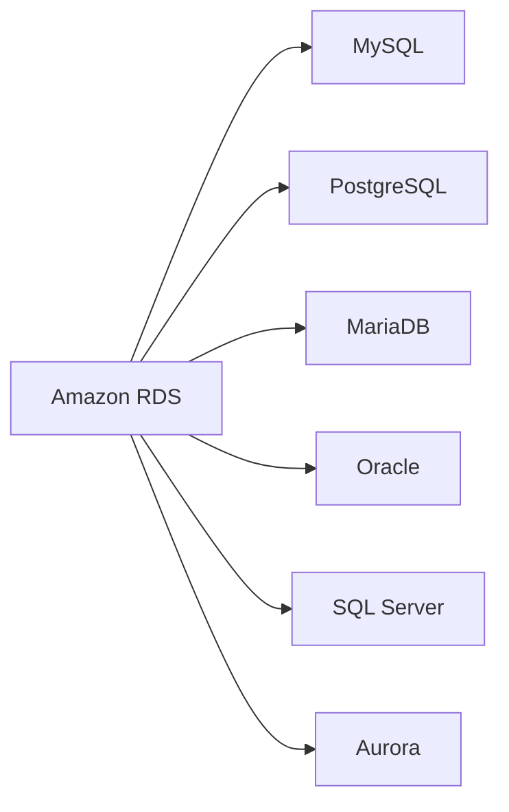

---

## Key Components

Supported engines:

| Engine | Open Source |
|----------|------------|
| MySQL | ✅ |
| PostgreSQL | ✅ |
| MariaDB | ✅ |
| Oracle | ❌ |
| SQL Server | ❌ |
| Amazon Aurora | AWS Managed |

---

## Types (if applicable)

See table above.

---

## Lifecycle / Workflow

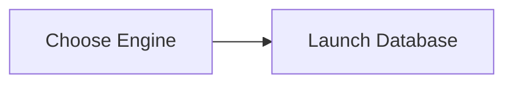

---

## Configuration / Syntax (if applicable)

Selected during database creation.

---

## Important Commands (if applicable)

```bash
aws rds describe-db-engine-versions
```

---

## Important Files (if applicable)

None.

---

## Real-World Use Cases

- Enterprise databases
- Open-source applications

---

## Advantages

- Multiple engine support

---

## Limitations

- Licensing costs for commercial databases

---

## Common Interview Questions (Concept Only)

- Which engines does RDS support?
- What is Amazon Aurora?

---

## Common Mistakes

- Selecting the wrong engine

---

## Troubleshooting

Verify engine compatibility.

---

## Summary

Amazon RDS supports multiple SQL database engines.

---

# Backups

## Overview

Amazon RDS provides automated backups and manual snapshots.

---

## Why It Is Used

- Disaster recovery
- Restore databases
- Protect data

---

## Architecture / Working

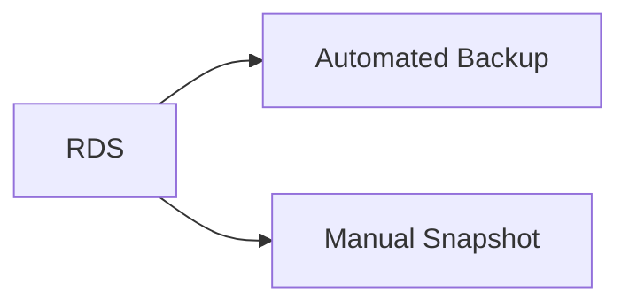

---

## Key Components

- Automated Backup
- Snapshot
- Point-in-Time Recovery

---

## Types (if applicable)

| Backup Type | Description |
|--------------|-------------|
| Automated Backup | Automatic |
| Snapshot | Manual |

---

## Lifecycle / Workflow

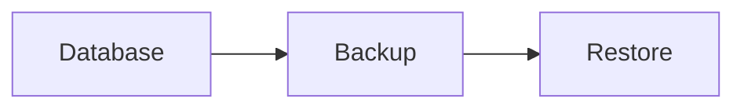

---

## Configuration / Syntax (if applicable)

Backup retention:

1–35 days.

---

## Important Commands (if applicable)

```bash
aws rds describe-db-snapshots
```

---

## Important Files (if applicable)

None.

---

## Real-World Use Cases

- Production recovery
- Compliance

---

## Advantages

- Automatic recovery

---

## Limitations

- Backup storage costs

---

## Common Interview Questions (Concept Only)

- Automated Backup vs Snapshot?

---

## Common Mistakes

- No backup retention

---

## Troubleshooting

Verify retention settings.

---

## Summary

RDS backups protect databases from accidental loss.

---

# Multi-AZ

## Overview

Multi-AZ creates a synchronous standby database in another Availability Zone.

If the primary database fails, AWS automatically performs failover.

> **Interview Tip**
>
> Multi-AZ is for **High Availability**, **NOT** Read Scaling.

---

## Why It Is Used

- High availability
- Disaster recovery
- Automatic failover

---

## Architecture / Working

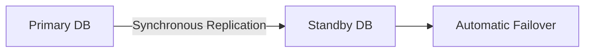

---

## Key Components

- Primary Database
- Standby Database

---

## Types (if applicable)

- Multi-AZ Deployment

---

## Lifecycle / Workflow

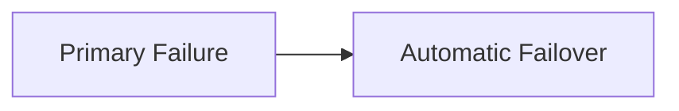

---

## Configuration / Syntax (if applicable)

Enabled during creation or modification.

---

## Important Commands (if applicable)

```bash
aws rds describe-db-instances
```

---

## Important Files (if applicable)

None.

---

## Real-World Use Cases

- Production databases

---

## Advantages

- Automatic failover
- High availability

---

## Limitations

- Increased cost
- Does not improve read performance

---

## Common Interview Questions (Concept Only)

- What is Multi-AZ?
- Does Multi-AZ improve performance?

---

## Common Mistakes

- Using Multi-AZ for reporting queries

---

## Troubleshooting

Verify Multi-AZ status.

---

## Summary

Multi-AZ provides automatic failover and high availability.

---

# Read Replicas

## Overview

Read Replicas create read-only copies of a database.

Replication is asynchronous.

Read Replicas improve read performance by distributing read traffic.

> **Interview Tip**
>
> Read Replicas are for **Read Scaling**, **NOT** High Availability.

---

## Why It Is Used

- Reporting
- Analytics
- Read scaling

---

## Architecture / Working

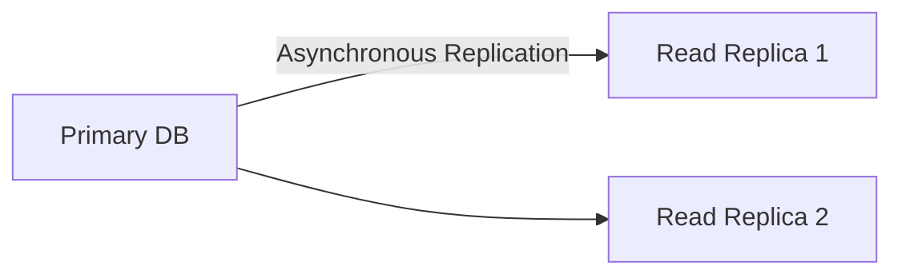

---

## Key Components

- Primary Database
- Replica Database

---

## Types (if applicable)

- Single Replica
- Multiple Replicas

---

## Lifecycle / Workflow

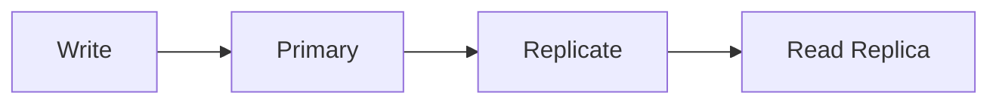

---

## Configuration / Syntax (if applicable)

Created after primary database.

---

## Important Commands (if applicable)

```bash
aws rds describe-db-instances
```

---

## Important Files (if applicable)

None.

---

## Real-World Use Cases

- BI dashboards
- Analytics
- Reporting

---

## Advantages

- Improves read performance

---

## Limitations

- Eventual consistency
- No automatic failover

---

## Common Interview Questions (Concept Only)

- What is Read Replica?
- Difference between Multi-AZ and Read Replica?

---

## Common Mistakes

- Using Read Replica for failover

---

## Troubleshooting

Monitor replication lag.

---

## Summary

Read Replicas improve read scalability but do not provide high availability.

---

# Amazon DynamoDB Basics

## Overview

Amazon DynamoDB is a fully managed, serverless NoSQL database.

It stores data as:

- Key-Value
- Document

DynamoDB automatically scales and delivers single-digit millisecond latency.

---

## Why It Is Used

- High-performance applications
- Gaming
- IoT
- Mobile apps
- Shopping carts

---

## Architecture / Working

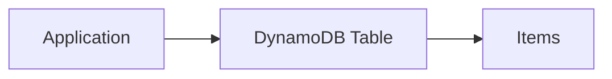

---

## Key Components

- Table
- Item
- Attribute
- Partition Key
- Sort Key

---

## Types (if applicable)

Data model:

- Key-Value
- Document

---

## Lifecycle / Workflow

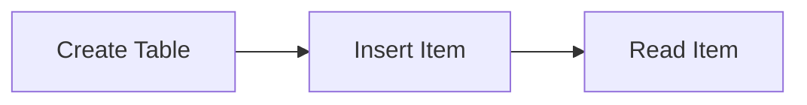

---

## Configuration / Syntax (if applicable)

Requires:

- Partition Key

Optional:

- Sort Key

---

## Important Commands (if applicable)

```bash
aws dynamodb list-tables

aws dynamodb describe-table
```

---

## Important Files (if applicable)

None.

---

## Real-World Use Cases

- Shopping carts
- User sessions
- Gaming leaderboards
- IoT devices

---

## Advantages

- Serverless
- Automatic scaling
- Low latency

---

## Limitations

- Different query model than SQL
- Limited joins and complex transactions compared to relational databases

---

## Common Interview Questions (Concept Only)

- What is DynamoDB?
- Difference between DynamoDB and RDS?
- What is a Partition Key?

---

## Common Mistakes

- Poor partition key design leading to hot partitions

---

## Troubleshooting

Monitor throttling and provisioned capacity usage.

---

## Summary

Amazon DynamoDB is a highly scalable NoSQL database optimized for low-latency applications.

---

# Interview Quick Revision

## AWS Database Services

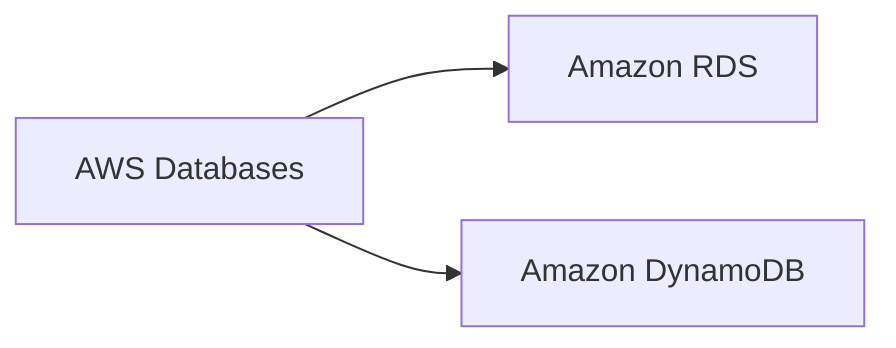

---

## RDS Architecture

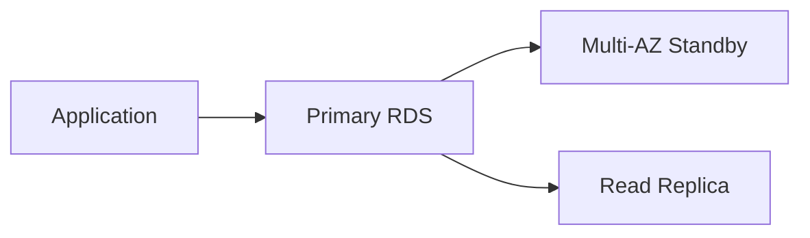

---

## Multi-AZ vs Read Replica

| Feature | Multi-AZ | Read Replica |
|----------|-----------|--------------|
| Purpose | High Availability | Read Scaling |
| Replication | Synchronous | Asynchronous |
| Automatic Failover | ✅ Yes | ❌ No |
| Read Performance | ❌ No | ✅ Yes |
| Standby Readable | ❌ No | ✅ Yes |

---

## RDS vs DynamoDB

| Amazon RDS | Amazon DynamoDB |
|-------------|-----------------|
| Relational Database | NoSQL Database |
| SQL | Key-Value / Document |
| Fixed Schema | Flexible Schema |
| Manual Capacity Selection | Automatic Scaling |
| Joins Supported | No Joins |
| Best for Structured Data | Best for High-Scale Applications |

---

## Automated Backup vs Snapshot

| Automated Backup | Snapshot |
|------------------|----------|
| Automatic | Manual |
| Supports Point-in-Time Recovery | No Point-in-Time Recovery |
| Deleted with Instance (unless retained) | Persists until manually deleted |
| Retention: 1–35 Days | Retained until deleted |

---

## AWS Database Best Practices

- Enable **Automated Backups** for production databases.
- Use **Multi-AZ** for high availability and automatic failover.
- Use **Read Replicas** to offload read-heavy workloads.
- Select the appropriate **RDS Engine** based on application requirements.
- Regularly monitor database performance using **Amazon CloudWatch**.
- Restrict database access using **Security Groups**.
- Place RDS instances in **Private Subnets**.
- Use **DynamoDB** for serverless, low-latency, high-scale NoSQL workloads.
- Regularly create manual snapshots before major upgrades or schema changes.
- Monitor replication lag for Read Replicas.

---

## One-line Interview Answer

**AWS provides managed relational databases through Amazon RDS and fully managed NoSQL databases through Amazon DynamoDB, offering automated backups, high availability with Multi-AZ, read scalability with Read Replicas, and simplified database management for production workloads.**
