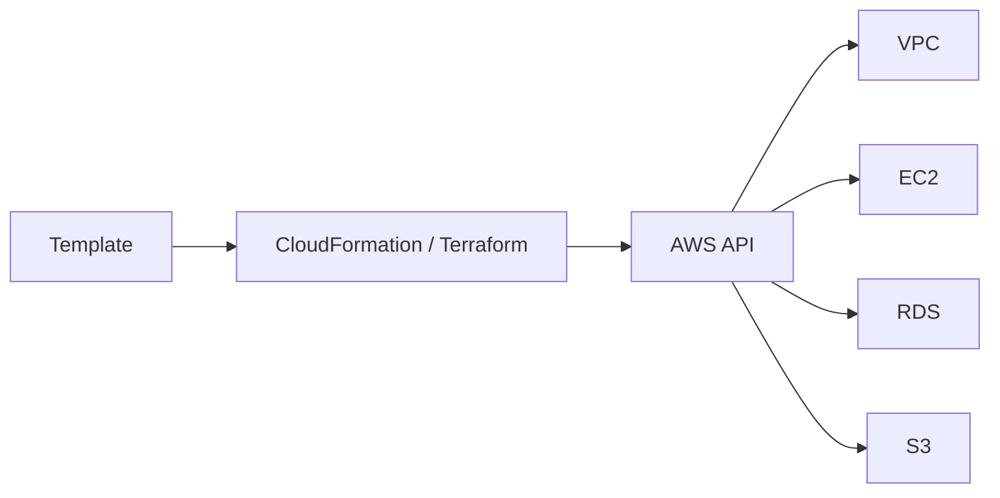
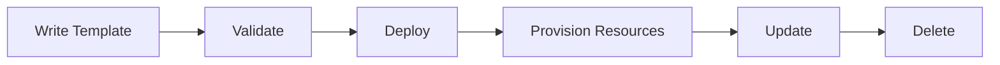
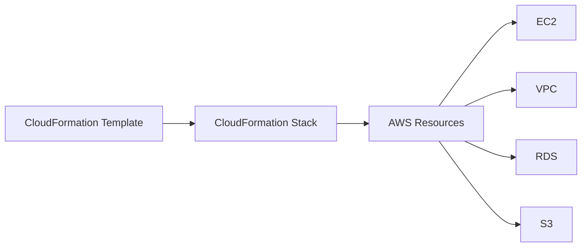
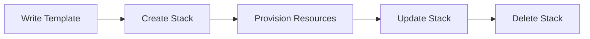
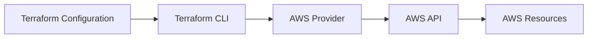
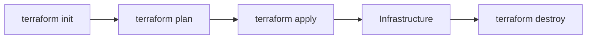
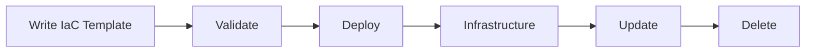
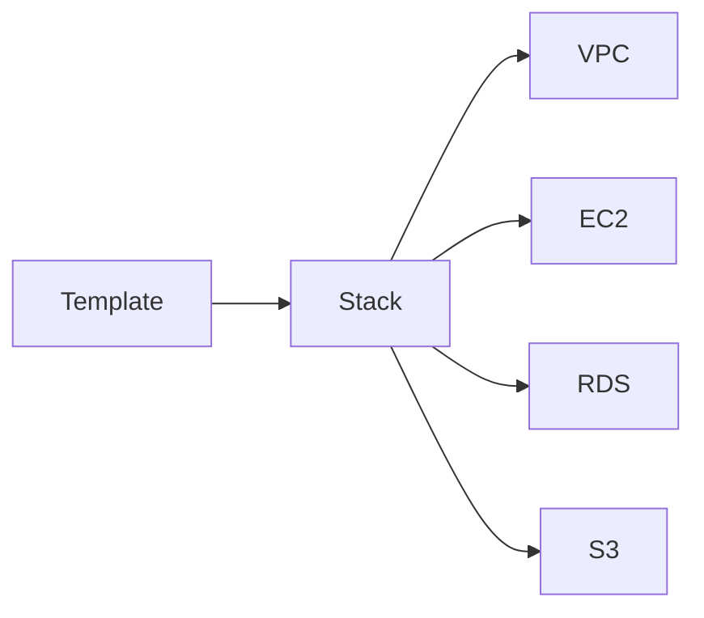
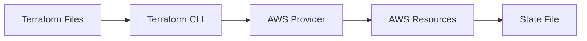

# Infrastructure as Code (IaC)

## Overview

Infrastructure as Code (IaC) is the practice of provisioning and managing infrastructure using **configuration files instead of manual operations**.

In AWS, the two most common IaC tools are:

- **AWS CloudFormation** – Native AWS Infrastructure as Code service.
- **Terraform** – Multi-cloud Infrastructure as Code tool developed by HashiCorp.

IaC enables infrastructure to be:

- Version controlled
- Repeatable
- Automated
- Consistent
- Scalable

> **Interview Tip**
>
> Infrastructure as Code is one of the most frequently asked DevOps interview topics. Be comfortable explaining:
>
> - IaC
> - CloudFormation
> - Terraform
> - CloudFormation vs Terraform
> - State Management
> - Templates

---

# Why It Is Used

Infrastructure as Code helps organizations:

- Automate infrastructure provisioning
- Eliminate manual configuration
- Reduce human errors
- Maintain consistent environments
- Enable CI/CD automation
- Simplify disaster recovery
- Support version control

---

# Architecture / Working



---

# Key Components

| Component | Purpose |
|-----------|----------|
| Template | Infrastructure definition |
| Resources | AWS services to create |
| Parameters | User inputs |
| Outputs | Export values |
| State (Terraform) | Tracks deployed resources |
| Stack (CloudFormation) | Collection of AWS resources |

---

# Types (if applicable)

| IaC Tool | Description |
|-----------|-------------|
| AWS CloudFormation | Native AWS IaC |
| Terraform | Multi-cloud IaC |

---

# Lifecycle / Workflow



---

# Configuration / Syntax (if applicable)

Typical IaC workflow:

1. Write infrastructure template
2. Validate template
3. Deploy infrastructure
4. Update infrastructure
5. Destroy infrastructure when no longer needed

---

# Important Commands (if applicable)

### CloudFormation

```bash
aws cloudformation create-stack

aws cloudformation update-stack

aws cloudformation delete-stack

aws cloudformation describe-stacks
```

### Terraform

```bash
terraform init

terraform plan

terraform apply

terraform destroy
```

---

# Important Files (if applicable)

| File | Purpose |
|------|----------|
| template.yaml | CloudFormation Template |
| template.json | CloudFormation Template |
| main.tf | Terraform Resources |
| variables.tf | Terraform Variables |
| outputs.tf | Terraform Outputs |
| terraform.tfvars | Variable Values |
| terraform.lock.hcl | Provider Lock File |
| terraform.tfstate | Infrastructure State |

---

# Real-World Use Cases

- Infrastructure provisioning
- CI/CD pipelines
- Multi-environment deployments
- Disaster recovery
- Kubernetes infrastructure
- VPC deployment
- Production automation

---

# Advantages

- Automation
- Version control
- Consistency
- Faster deployments
- Repeatability
- Reduced manual effort

---

# Limitations

- Learning curve
- Incorrect templates can affect production
- Terraform state requires secure management
- CloudFormation is AWS-specific

---

# Common Interview Questions (Concept Only)

- What is Infrastructure as Code?
- What are the benefits of IaC?
- What is CloudFormation?
- What is Terraform?
- Difference between CloudFormation and Terraform?
- What is a CloudFormation Stack?
- What is Terraform State?
- Can Terraform manage AWS resources?
- Can CloudFormation manage Azure resources?

---

# Common Mistakes

- Editing infrastructure manually after IaC deployment
- Storing Terraform state locally in production
- Hardcoding secrets in templates
- Not using version control
- Ignoring template validation

---

# Troubleshooting

| Problem | Solution |
|----------|----------|
| Stack creation failed | Check CloudFormation Events |
| Terraform apply failed | Run `terraform plan` first |
| State file conflict | Use remote backend with locking |
| Resource already exists | Import existing resource or remove duplicate definition |
| Template validation error | Validate syntax before deployment |

---

# Summary

Infrastructure as Code enables automated, repeatable, and version-controlled infrastructure deployment. AWS CloudFormation provides native AWS IaC capabilities, while Terraform offers a cloud-agnostic solution supporting multiple providers.

---

# AWS CloudFormation Basics

## Overview

AWS CloudFormation is AWS's native Infrastructure as Code service used to provision and manage AWS resources using templates.

Instead of creating resources manually, developers define infrastructure in **YAML** or **JSON** templates.

---

## Why It Is Used

CloudFormation helps to:

- Automate infrastructure
- Standardize deployments
- Manage resources as code
- Roll back failed deployments
- Simplify updates

---

## Architecture / Working



---

## Key Components

| Component | Purpose |
|-----------|----------|
| Template | Infrastructure definition |
| Stack | Collection of AWS resources |
| Resources | AWS services |
| Parameters | User inputs |
| Outputs | Export values |
| Mappings | Static values |
| Conditions | Conditional resource creation |

---

## Types (if applicable)

CloudFormation templates can be written in:

- YAML
- JSON

---

## Lifecycle / Workflow



---

## Configuration / Syntax (if applicable)

Basic template sections:

```yaml
AWSTemplateFormatVersion:
Description:
Parameters:
Resources:
Outputs:
```

---

## Important Commands (if applicable)

```bash
aws cloudformation create-stack

aws cloudformation update-stack

aws cloudformation delete-stack

aws cloudformation list-stacks

aws cloudformation validate-template
```

---

## Important Files (if applicable)

| File | Purpose |
|------|----------|
| template.yaml | CloudFormation template |
| template.json | CloudFormation template |

---

## Real-World Use Cases

- VPC deployment
- EC2 deployment
- IAM provisioning
- Networking automation
- CI/CD pipelines

---

## Advantages

- Native AWS service
- Automatic rollback
- Dependency management
- No additional software

---

## Limitations

- AWS only
- Limited support for non-AWS resources
- Large templates become difficult to maintain

---

## Common Interview Questions (Concept Only)

- What is CloudFormation?
- What is a Stack?
- What is a Template?
- What happens if Stack creation fails?
- Which formats are supported?

---

## Common Mistakes

- Hardcoding values
- Large monolithic templates
- Ignoring rollback events

---

## Troubleshooting

- Check Stack Events.
- Validate template syntax.
- Verify IAM permissions.
- Review resource dependency errors.

---

## Summary

CloudFormation is AWS's native Infrastructure as Code service that provisions AWS resources using declarative templates and manages them as stacks.

---

# Terraform Integration

## Overview

Terraform is an open-source Infrastructure as Code tool developed by HashiCorp.

Terraform supports multiple cloud providers, including:

- AWS
- Azure
- Google Cloud
- Kubernetes
- VMware

Terraform communicates with cloud providers using provider plugins.

---

## Why It Is Used

Terraform is used because it:

- Supports multiple clouds
- Uses declarative configuration
- Maintains infrastructure state
- Integrates with CI/CD
- Supports reusable modules

---

## Architecture / Working



---

## Key Components

| Component | Purpose |
|-----------|----------|
| Provider | Connects Terraform to AWS |
| Resource | Infrastructure object |
| Variable | User input |
| Output | Exported value |
| Module | Reusable infrastructure |
| State File | Tracks deployed resources |

---

## Types (if applicable)

Terraform deployment workflow:

- Init
- Plan
- Apply
- Destroy

---

## Lifecycle / Workflow



---

## Configuration / Syntax (if applicable)

Basic workflow:

```bash
terraform init

terraform plan

terraform apply
```

---

## Important Commands (if applicable)

```bash
terraform init

terraform validate

terraform fmt

terraform plan

terraform apply

terraform destroy

terraform show

terraform state list
```

---

## Important Files (if applicable)

| File | Purpose |
|------|----------|
| main.tf | Resources |
| variables.tf | Variables |
| outputs.tf | Outputs |
| providers.tf | Provider configuration |
| terraform.tfvars | Variable values |
| terraform.tfstate | State file |

---

## Real-World Use Cases

- AWS infrastructure
- Multi-cloud deployments
- Kubernetes clusters
- CI/CD automation
- Dev/Test environment provisioning

---

## Advantages

- Multi-cloud support
- Modular design
- Large provider ecosystem
- Reusable modules
- Strong community support

---

## Limitations

- State management complexity
- State file security
- Provider compatibility issues
- Requires remote backend for team collaboration

---

## Common Interview Questions (Concept Only)

- What is Terraform?
- What is Terraform State?
- What is a Provider?
- What is a Module?
- What is `terraform plan`?
- Difference between `terraform plan` and `terraform apply`?

---

## Common Mistakes

- Storing state locally in team environments
- Committing state files to Git
- Hardcoding secrets
- Skipping `terraform plan`

---

## Troubleshooting

- Run `terraform validate`.
- Run `terraform fmt`.
- Verify AWS credentials.
- Check state file consistency.
- Configure remote backend with state locking.

---

## Summary

Terraform is a cloud-agnostic Infrastructure as Code tool that automates infrastructure provisioning across multiple cloud providers while maintaining infrastructure state.

---

# Interview Quick Revision

## Infrastructure as Code Workflow



---

## CloudFormation Architecture



---

## Terraform Architecture



---

## CloudFormation vs Terraform

| CloudFormation | Terraform |
|----------------|-----------|
| AWS Native | Multi-cloud |
| YAML/JSON | HCL |
| Uses Stacks | Uses State File |
| Automatic Rollback | Manual recovery depending on state |
| AWS Resources | Multiple Providers |
| No Installation Required | Requires Terraform CLI |

---

## CloudFormation Stack Lifecycle

| Stage | Description |
|--------|-------------|
| Create | Deploy resources |
| Update | Modify infrastructure |
| Rollback | Recover failed deployment |
| Delete | Remove resources |

---

## Terraform Workflow

| Command | Purpose |
|----------|----------|
| `terraform init` | Initialize project |
| `terraform validate` | Validate configuration |
| `terraform fmt` | Format code |
| `terraform plan` | Preview changes |
| `terraform apply` | Create/update infrastructure |
| `terraform destroy` | Remove infrastructure |

---

## AWS IaC Best Practices

- Store all infrastructure code in **Git**.
- Use **parameters/variables** instead of hardcoded values.
- Validate templates before deployment.
- Use **modular templates** for reusable infrastructure.
- Never store secrets directly in IaC templates.
- Store Terraform state in a **remote backend** (e.g., Amazon S3) with **DynamoDB state locking**.
- Use separate environments (Dev, Test, Production).
- Review infrastructure changes with `terraform plan` before applying.
- Apply the principle of least privilege for IAM roles used by IaC.
- Automate IaC deployments through CI/CD pipelines.

---

## One-line Interview Answer

**Infrastructure as Code automates infrastructure provisioning using configuration files. AWS CloudFormation is AWS's native IaC service that manages resources through stacks and templates, while Terraform is a cloud-agnostic IaC tool that provisions infrastructure across multiple platforms using declarative configurations and state management.**
