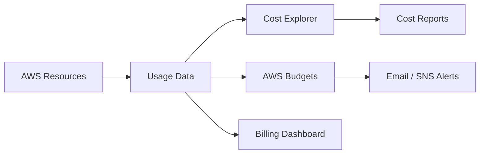
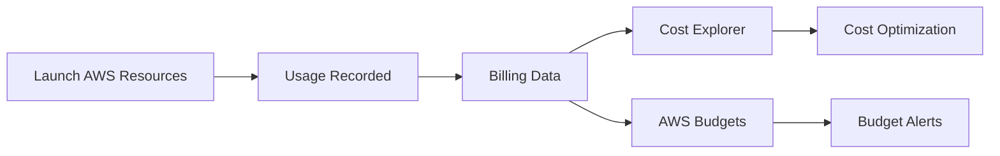
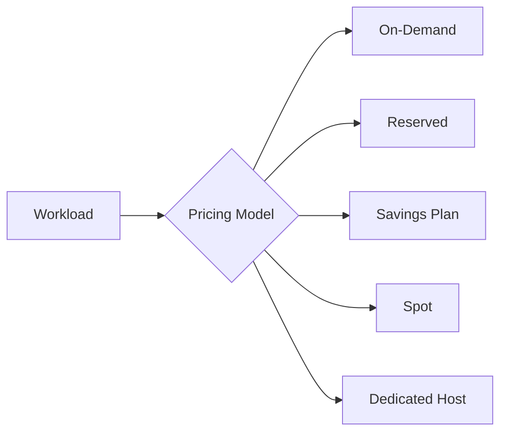
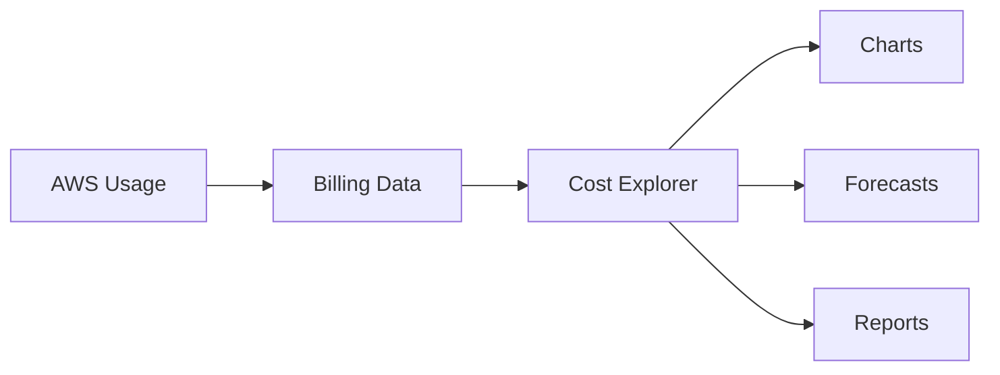
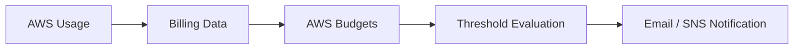
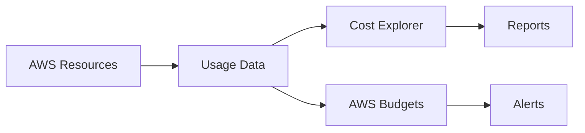

# Cost Management

## Overview

AWS Cost Management consists of tools and pricing models that help organizations monitor, optimize, and control cloud spending. Understanding AWS pricing and cost optimization is essential for both AWS certification exams and real-world DevOps/Cloud Engineer roles.

The core AWS Cost Management topics include:

- **AWS Pricing Models** – Different ways to pay for AWS resources
- **AWS Free Tier** – Free usage for learning and testing
- **AWS Cost Explorer** – Analyze and visualize AWS costs
- **AWS Budgets** – Set spending thresholds and receive alerts

> **Interview Tip**
>
> Frequently asked topics:
>
> - AWS Pricing Models
> - On-Demand vs Reserved vs Spot Instances
> - AWS Free Tier
> - Cost Explorer
> - AWS Budgets
> - Cost Optimization Best Practices

---

# Why It Is Used

AWS Cost Management helps organizations:

- Reduce cloud costs
- Monitor resource usage
- Forecast future expenses
- Detect unexpected spending
- Optimize infrastructure costs
- Prevent budget overruns
- Improve financial planning

---

# Architecture / Working



---

# Key Components

| Component | Purpose |
|-----------|----------|
| AWS Pricing Models | Different payment options |
| AWS Free Tier | Free AWS resource usage |
| Cost Explorer | Analyze and visualize costs |
| AWS Budgets | Monitor and alert on spending |
| Billing Dashboard | View current charges |
| Cost Allocation Tags | Track resource costs |

---

# Types (if applicable)

AWS Pricing Models

| Pricing Model | Description |
|---------------|-------------|
| On-Demand | Pay per use |
| Reserved Instances (RI) | Long-term discounted pricing |
| Savings Plans | Flexible discounted pricing |
| Spot Instances | Use unused EC2 capacity at discounted prices |
| Dedicated Hosts | Physical server dedicated to one customer |

---

# Lifecycle / Workflow



---

# Configuration / Syntax (if applicable)

Typical workflow:

1. Launch AWS resources
2. AWS records usage
3. Billing data is generated
4. Analyze costs using Cost Explorer
5. Configure AWS Budgets
6. Optimize spending

---

# Important Commands (if applicable)

```bash
aws ce

aws budgets

aws pricing
```

---

# Important Files (if applicable)

No mandatory configuration files.

---

# Real-World Use Cases

- Monthly cost tracking
- Budget monitoring
- Forecast cloud expenses
- Cost optimization
- Resource rightsizing
- Department-wise billing
- Project cost tracking

---

# Advantages

- Centralized billing
- Cost visibility
- Budget alerts
- Forecasting
- Cost optimization recommendations
- Resource usage analysis

---

# Limitations

- Cost Explorer data is not real-time
- Savings require proper planning
- Spot Instances can be interrupted
- Reserved Instances require commitment

---

# Common Interview Questions (Concept Only)

- What are AWS Pricing Models?
- Difference between On-Demand and Reserved Instances?
- What are Spot Instances?
- What is AWS Free Tier?
- What is AWS Cost Explorer?
- What is AWS Budgets?
- What are Cost Allocation Tags?

---

# Common Mistakes

- Leaving unused resources running
- Not deleting unattached EBS volumes
- Forgetting to stop idle EC2 instances
- Ignoring budget alerts
- Choosing incorrect pricing models
- Not monitoring monthly costs

---

# Troubleshooting

| Problem | Solution |
|----------|----------|
| Unexpected high bill | Review Cost Explorer and Billing Dashboard |
| Budget alert not received | Verify Budget configuration and SNS/email notifications |
| High EC2 cost | Evaluate Reserved or Spot Instances |
| Storage costs increasing | Review S3 lifecycle policies and unused EBS volumes |
| Unused resources | Use Trusted Advisor or Cost Explorer recommendations |

---

# Summary

AWS Cost Management provides tools and pricing options that help organizations optimize cloud spending, monitor resource costs, and prevent unexpected expenses.

---

# AWS Pricing Models

## Overview

AWS offers multiple pricing models to match different workload requirements and cost optimization goals.

Choosing the correct pricing model can significantly reduce cloud costs.

---

## Why It Is Used

- Optimize costs
- Match workload requirements
- Reduce infrastructure expenses
- Improve budget planning

---

## Architecture / Working



---

## Key Components

| Pricing Model | Best For |
|---------------|----------|
| On-Demand | Short-term or unpredictable workloads |
| Reserved Instance | Long-term predictable workloads |
| Savings Plan | Flexible compute usage |
| Spot Instance | Fault-tolerant workloads |
| Dedicated Host | Compliance and licensing requirements |

---

## Types (if applicable)

### 1. On-Demand Pricing

- No long-term commitment
- Pay per second or hour
- Highest flexibility
- Highest cost

**Use Cases**

- Development
- Testing
- Temporary workloads

---

### 2. Reserved Instances (RI)

- 1-year or 3-year commitment
- Significant discount compared to On-Demand
- Suitable for predictable workloads

**Use Cases**

- Production applications
- Databases
- Long-running services

---

### 3. Savings Plans

- Commit to consistent compute usage
- Flexible across instance families
- Often preferred over Reserved Instances

---

### 4. Spot Instances

- Uses unused AWS capacity
- Up to 90% cheaper than On-Demand
- Can be interrupted at any time

**Use Cases**

- Batch processing
- CI/CD builds
- Data analytics
- Fault-tolerant workloads

---

### 5. Dedicated Hosts

- Physical server dedicated to one customer
- Required for certain licensing or compliance needs

---

## Lifecycle / Workflow


---

## Configuration / Syntax (if applicable)

Pricing model is selected during resource provisioning.

---

## Important Commands (if applicable)

Managed through AWS Console or CLI.

---

## Important Files (if applicable)

None.

---

## Real-World Use Cases

- Spot for Kubernetes worker nodes
- Reserved for databases
- On-Demand for development
- Savings Plans for production

---

## Advantages

- Flexible pricing
- Cost optimization
- Suitable for different workloads

---

## Limitations

- Spot interruptions
- Reserved commitment
- Savings Plans require forecasting

---

## Common Interview Questions (Concept Only)

- Difference between On-Demand and Reserved Instances?
- What are Spot Instances?
- What are Savings Plans?
- Which pricing model is cheapest?

---

## Common Mistakes

- Using On-Demand for production
- Running Spot for critical applications
- Purchasing Reserved Instances without analysis

---

## Troubleshooting

- Review utilization.
- Use Cost Explorer recommendations.
- Monitor Spot interruptions.

---

## Summary

AWS Pricing Models provide flexible payment options based on workload characteristics and cost optimization goals.

---

# AWS Free Tier

## Overview

AWS Free Tier allows users to explore AWS services without incurring charges, within predefined usage limits.

It is commonly used for:

- Learning AWS
- Certification preparation
- Small projects
- Development and testing

---

## Why It Is Used

- Learn AWS
- Experiment with services
- Build proof-of-concept applications
- Reduce initial costs

---

## Key Components

| Feature | Description |
|----------|-------------|
| 12-Month Free Tier | Available for new AWS accounts |
| Always Free | Services with permanent free quotas |
| Free Trials | Limited-duration access to specific services |

---

## Real-World Use Cases

- Student projects
- AWS learning labs
- Small websites
- Dev/Test environments

---

## Advantages

- Free learning environment
- Easy experimentation
- Hands-on practice

---

## Limitations

- Usage limits apply
- Charges begin after limits are exceeded

---

## Common Interview Questions (Concept Only)

- What is AWS Free Tier?
- What happens when Free Tier limits are exceeded?

---

## Summary

AWS Free Tier provides limited free access to AWS services for learning, testing, and small-scale workloads.

---

# AWS Cost Explorer

## Overview

AWS Cost Explorer is a visualization and reporting tool that helps organizations analyze AWS costs and usage over time.

It provides:

- Historical spending
- Usage trends
- Forecasting
- Service-level cost breakdown
- Resource-level analysis

---

## Why It Is Used

- Analyze monthly spending
- Identify expensive services
- Forecast future costs
- Optimize infrastructure

---

## Architecture / Working



---

## Key Components

| Component | Purpose |
|-----------|----------|
| Cost Reports | Spending analysis |
| Forecast | Predict future costs |
| Filters | Analyze by service, region, tag |
| Graphs | Visual representation |

---

## Lifecycle / Workflow


---

## Configuration / Syntax (if applicable)

Enable Cost Explorer in the Billing Console.

---

## Important Commands (if applicable)

```bash
aws ce get-cost-and-usage
```

---

## Important Files (if applicable)

None.

---

## Real-World Use Cases

- Monthly billing analysis
- Cost forecasting
- Department cost allocation
- Resource optimization

---

## Advantages

- Easy visualization
- Forecasting
- Historical analysis
- Service-wise cost breakdown

---

## Limitations

- Data updates are not real-time
- Requires billing access

---

## Common Interview Questions (Concept Only)

- What is AWS Cost Explorer?
- Can Cost Explorer forecast costs?
- How often is Cost Explorer updated?

---

## Common Mistakes

- Ignoring cost trends
- Not using cost allocation tags
- Reviewing costs only after billing cycle

---

## Troubleshooting

- Enable Cost Explorer.
- Verify billing permissions.
- Apply appropriate filters.

---

## Summary

AWS Cost Explorer helps analyze historical costs, forecast spending, and identify opportunities for cost optimization.

---

# AWS Budgets

## Overview

AWS Budgets allows organizations to define spending limits and receive notifications when actual or forecasted costs exceed predefined thresholds.

Budgets help prevent unexpected AWS bills.

---

## Why It Is Used

- Monitor spending
- Receive alerts
- Prevent budget overruns
- Improve financial governance

---

## Architecture / Working



---

## Key Components

| Component | Purpose |
|-----------|----------|
| Cost Budget | Monitor spending |
| Usage Budget | Monitor resource usage |
| Forecast Budget | Predict future spending |
| Alert | Notification when thresholds are exceeded |

---

## Types (if applicable)

- Cost Budget
- Usage Budget
- Reservation Budget
- Savings Plans Budget

---

## Lifecycle / Workflow


---

## Configuration / Syntax (if applicable)

Typical workflow:

1. Create budget
2. Set threshold
3. Configure notification
4. Monitor spending

---

## Important Commands (if applicable)

```bash
aws budgets describe-budgets
```

---

## Important Files (if applicable)

None.

---

## Real-World Use Cases

- Monthly spending alerts
- Department budgets
- Project budgets
- Development environment limits

---

## Advantages

- Proactive alerts
- Budget forecasting
- Easy configuration
- Multiple budget types

---

## Limitations

- Does not stop resource creation automatically
- Alerts depend on billing data updates

---

## Common Interview Questions (Concept Only)

- What is AWS Budgets?
- Difference between AWS Budgets and Cost Explorer?
- Can AWS Budgets stop EC2 instances automatically?

---

## Common Mistakes

- Setting unrealistic budget thresholds
- Ignoring budget alerts
- Not configuring notifications

---

## Troubleshooting

- Verify email/SNS notifications.
- Check budget status.
- Review billing permissions.

---

## Summary

AWS Budgets helps organizations monitor spending, forecast costs, and receive alerts before costs exceed predefined limits.

---

# Interview Quick Revision

## AWS Cost Management Architecture



---

## AWS Pricing Models

| Pricing Model | Best For |
|---------------|----------|
| On-Demand | Short-term workloads |
| Reserved Instances | Predictable long-term workloads |
| Savings Plans | Flexible long-term compute usage |
| Spot Instances | Fault-tolerant workloads |
| Dedicated Hosts | Compliance and licensing |

---

## Cost Explorer vs AWS Budgets

| Cost Explorer | AWS Budgets |
|---------------|-------------|
| Analyze historical costs | Monitor spending against limits |
| Forecast future costs | Send budget alerts |
| Reporting and visualization | Budget notifications |
| Cost optimization insights | Financial governance |

---

## AWS Free Tier Categories

| Category | Description |
|----------|-------------|
| 12-Month Free Tier | Available for new accounts |
| Always Free | Permanent free quotas |
| Free Trials | Limited-time access to selected services |

---

## Cost Optimization Best Practices

- Use **Reserved Instances** or **Savings Plans** for predictable workloads.
- Use **Spot Instances** for fault-tolerant applications.
- Stop or terminate unused EC2 instances.
- Delete unattached EBS volumes and unused Elastic IP addresses.
- Configure **S3 Lifecycle Policies** to move infrequently accessed data to cheaper storage classes.
- Use **AWS Cost Explorer** regularly to identify cost trends.
- Configure **AWS Budgets** with email or SNS alerts.
- Apply **Cost Allocation Tags** to track spending by project or department.
- Monitor recommendations from **AWS Trusted Advisor**.
- Right-size overprovisioned resources.

---

## One-line Interview Answer

**AWS Cost Management includes flexible pricing models such as On-Demand, Reserved Instances, Savings Plans, and Spot Instances, along with tools like AWS Cost Explorer for cost analysis and AWS Budgets for proactive spending alerts, enabling organizations to optimize cloud costs and maintain financial control.**
