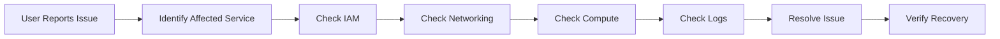
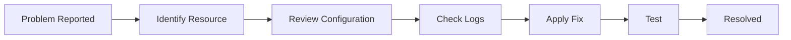
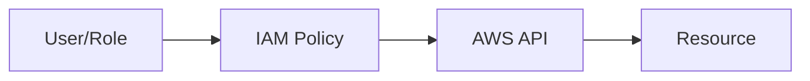
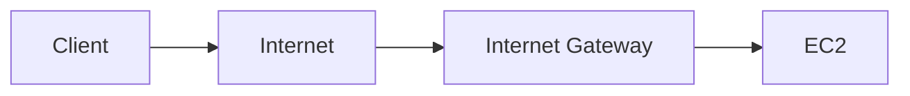
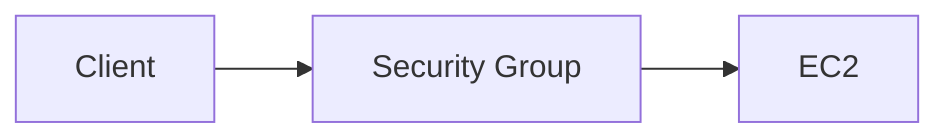
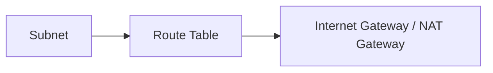
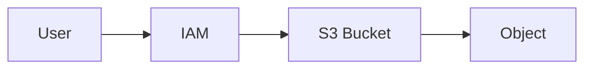
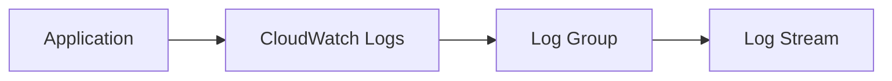
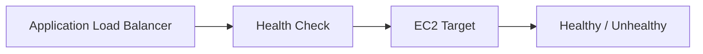
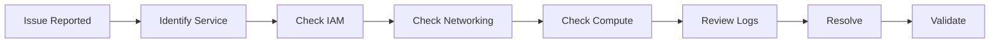

# AWS Troubleshooting

## Overview

Troubleshooting is one of the most important practical skills for AWS Cloud Engineers, DevOps Engineers, Platform Engineers, and SREs.

Most production issues are caused by:

- IAM permission problems
- Network misconfigurations
- Incorrect Security Group rules
- Route Table issues
- EC2 connectivity failures
- S3 permission errors
- Load Balancer health check failures
- Missing application logs

A structured troubleshooting approach helps quickly identify and resolve issues while minimizing downtime.

> **Interview Tip**
>
> Most AWS troubleshooting interview questions revolve around:
>
> - Why can't I SSH into an EC2 instance?
> - Why is my application unreachable?
> - Why am I getting "Access Denied"?
> - Why is my EC2 instance marked unhealthy?
> - Why can't my application access S3?
> - How do you troubleshoot AWS resources?

---

# Why It Is Used

Troubleshooting helps to:

- Identify production issues
- Restore application availability
- Diagnose infrastructure failures
- Verify security configurations
- Improve system reliability
- Reduce downtime

---

# Architecture / Working



---

# Key Components

| Component | Purpose |
|-----------|----------|
| IAM | Authentication & Authorization |
| EC2 | Compute troubleshooting |
| Security Groups | Firewall rules |
| Route Tables | Network routing |
| S3 | Object storage permissions |
| CloudWatch | Metrics and logs |
| Elastic Load Balancer | Traffic distribution |
| VPC | Networking |

---

# Types (if applicable)

Common troubleshooting categories:

| Category | Examples |
|----------|----------|
| Authentication | IAM AccessDenied |
| Compute | EC2 unreachable |
| Network | Route table errors |
| Firewall | Security Group issues |
| Storage | S3 AccessDenied |
| Monitoring | Missing logs |
| Load Balancing | Health check failures |

---

# Lifecycle / Workflow



---

# Configuration / Syntax (if applicable)

General troubleshooting approach:

1. Identify the affected AWS service.
2. Verify IAM permissions.
3. Check networking (VPC, Route Tables, Security Groups).
4. Review CloudWatch metrics and logs.
5. Verify application status.
6. Apply corrective actions.
7. Validate functionality after the fix.

---

# Important Commands (if applicable)

```bash
aws sts get-caller-identity

aws ec2 describe-instances

aws ec2 describe-security-groups

aws ec2 describe-route-tables

aws s3 ls

aws logs describe-log-groups

aws elbv2 describe-target-health
```

---

# Important Files (if applicable)

| File | Purpose |
|------|----------|
| ~/.aws/config | AWS CLI configuration |
| ~/.aws/credentials | AWS CLI credentials |
| /var/log/cloud-init.log | EC2 initialization logs |
| /var/log/messages | Linux system logs |
| /var/log/syslog | Ubuntu system logs |
| Application logs | Application troubleshooting |

---

# Real-World Use Cases

- Application not reachable
- SSH failure
- S3 upload failures
- CI/CD deployment failures
- EC2 startup problems
- Load Balancer unhealthy targets
- IAM permission troubleshooting
- Network connectivity issues

---

# Advantages

- Faster incident resolution
- Better system reliability
- Reduced downtime
- Improved production stability
- Easier root cause analysis

---

# Limitations

- Requires knowledge of multiple AWS services
- Complex environments may involve several interacting issues
- Root cause identification can take time

---

# Common Interview Questions (Concept Only)

- How do you troubleshoot an AWS application?
- Why can't you SSH into an EC2 instance?
- How do you troubleshoot an AccessDenied error?
- Why is an EC2 instance unhealthy behind an ALB?
- How do you troubleshoot S3 permission issues?
- How do you verify Security Group rules?
- What tools do you use for AWS troubleshooting?
- What is your troubleshooting methodology?

---

# Common Mistakes

- Ignoring IAM permissions
- Forgetting inbound Security Group rules
- Missing outbound Security Group rules
- Incorrect Route Table associations
- Reviewing only application logs
- Not checking CloudWatch metrics
- Using the root account for troubleshooting
- Skipping health check verification

---

# Troubleshooting

## IAM Permission Issues

### Overview

IAM permission issues occur when an IAM user, role, or service lacks the required permissions to perform an AWS action.

Common errors:

- AccessDenied
- UnauthorizedOperation
- AccessDeniedException

---

### Why It Happens

- Missing IAM policy
- Explicit deny
- Incorrect IAM role
- Missing trust relationship
- Incorrect resource ARN
- Missing permissions boundary

---

### Architecture / Working



---

### Troubleshooting Steps

- Verify the IAM identity.
- Review attached IAM policies.
- Check for explicit deny statements.
- Confirm resource ARN correctness.
- Validate IAM role trust policy.
- Use the IAM Policy Simulator if needed.

---

### Useful Commands

```bash
aws sts get-caller-identity

aws iam list-attached-user-policies

aws iam list-attached-role-policies
```

---

### Common Interview Questions

- What causes AccessDenied?
- Difference between IAM User and IAM Role?
- What is an explicit deny?
- How do you troubleshoot IAM permissions?

---

### Summary

Most IAM issues are caused by missing permissions, incorrect roles, or explicit deny policies.

---

## EC2 Connectivity Issues

### Overview

EC2 connectivity issues are among the most common production problems.

Common symptoms:

- SSH timeout
- Connection refused
- Instance unreachable
- Application unavailable

---

### Why It Happens

- Instance stopped
- Incorrect Security Group
- Network ACL issue
- Missing Internet Gateway
- Wrong Route Table
- SSH service stopped
- Wrong key pair
- Incorrect public IP

---

### Architecture / Working



---

### Troubleshooting Steps

- Verify EC2 instance is running.
- Confirm the correct public IP or Elastic IP.
- Check Security Group inbound rules (TCP 22 for SSH).
- Verify Route Table includes a route to the Internet Gateway.
- Ensure the subnet is public (if internet access is required).
- Confirm the SSH service is running.
- Validate the SSH key pair and file permissions.

---

### Useful Commands

```bash
ssh -i key.pem ec2-user@public-ip

systemctl status sshd

ping
```

---

### Common Interview Questions

- Why can't you SSH into EC2?
- What should you check first?
- How do Security Groups affect SSH?

---

### Summary

Most EC2 connectivity issues are related to networking, security groups, or SSH configuration.

---

## Security Group Issues

### Overview

Security Groups act as stateful virtual firewalls that control traffic to and from EC2 instances.

---

### Common Problems

- Missing inbound rule
- Wrong port
- Incorrect source CIDR
- Wrong Security Group attached
- Missing outbound rule (rare)

---

### Architecture / Working



---

### Troubleshooting Steps

- Verify the correct Security Group is attached.
- Check inbound rules for the required port.
- Confirm the source CIDR or Security Group reference.
- Review outbound rules if outbound traffic is failing.

---

### Useful Commands

```bash
aws ec2 describe-security-groups
```

---

### Common Interview Questions

- Are Security Groups stateful?
- Difference between Security Groups and Network ACLs?
- Why is port 80 not reachable?

---

### Summary

Security Groups are one of the most common causes of AWS connectivity issues.

---

## Route Table Issues

### Overview

Route Tables determine how network traffic is routed within a VPC.

---

### Common Problems

- Missing Internet Gateway route
- Incorrect NAT Gateway route
- Wrong subnet association
- Incorrect local route changes

---

### Architecture / Working



---

### Troubleshooting Steps

- Verify subnet association.
- Check default route (`0.0.0.0/0`).
- Confirm Internet Gateway attachment.
- Verify NAT Gateway for private subnets.

---

### Useful Commands

```bash
aws ec2 describe-route-tables
```

---

### Common Interview Questions

- Why can't an EC2 instance access the internet?
- What is the role of a Route Table?
- Difference between public and private Route Tables?

---

### Summary

Incorrect routing often prevents internet access and communication between resources.

---

## S3 Access Issues

### Overview

S3 access failures are typically permission-related.

Common errors:

- AccessDenied
- NoSuchBucket
- Forbidden

---

### Why It Happens

- Missing IAM permissions
- Bucket policy denial
- Block Public Access settings
- Wrong bucket name
- Missing object permissions
- Encryption restrictions

---

### Architecture / Working



---

### Troubleshooting Steps

- Verify IAM permissions.
- Review Bucket Policy.
- Check Block Public Access settings.
- Confirm bucket and object names.
- Validate KMS permissions if encryption is enabled.

---

### Useful Commands

```bash
aws s3 ls

aws s3 cp

aws s3api get-bucket-policy
```

---

### Common Interview Questions

- Why are you getting AccessDenied on S3?
- What is the difference between IAM Policy and Bucket Policy?

---

### Summary

Most S3 access issues are caused by IAM policies, bucket policies, or Block Public Access configuration.

---

## CloudWatch Logs

### Overview

Amazon CloudWatch Logs centralizes logs from AWS resources and applications.

It is the primary service for investigating application and infrastructure issues.

---

### Why It Is Used

- Application logs
- EC2 logs
- Lambda logs
- System logs
- Troubleshooting
- Monitoring

---

### Architecture / Working



---

### Troubleshooting Steps

- Check the relevant Log Group.
- Review Log Streams.
- Search for exceptions and errors.
- Correlate logs with CloudWatch Metrics.

---

### Useful Commands

```bash
aws logs describe-log-groups

aws logs describe-log-streams
```

---

### Common Interview Questions

- What is a Log Group?
- What is a Log Stream?
- How do you troubleshoot using CloudWatch Logs?

---

### Summary

CloudWatch Logs is the first place to investigate application and infrastructure failures in AWS.

---

## Load Balancer Health Checks

### Overview

Elastic Load Balancers continuously check the health of registered targets.

If a target fails health checks, traffic is no longer routed to it.

---

### Why It Happens

- Application not running
- Wrong health check path
- Wrong port
- Security Group blocks health checks
- Target service failure
- Slow application startup

---

### Architecture / Working



---

### Troubleshooting Steps

- Verify the application is running.
- Confirm the health check path returns HTTP 200.
- Check Security Group rules between the ALB and target.
- Validate target group configuration.
- Review application logs and CloudWatch metrics.

---

### Useful Commands

```bash
aws elbv2 describe-target-health
```

---

### Common Interview Questions

- Why is an EC2 instance unhealthy?
- How does an ALB determine target health?
- What happens when health checks fail?

---

### Summary

Health check failures are commonly caused by application errors, incorrect health check configuration, or networking issues.

---

# Summary

AWS troubleshooting requires a systematic approach that combines IAM verification, networking checks, compute diagnostics, log analysis, and service-specific validation. For DevOps and Cloud Engineers, mastering common issues such as IAM permission errors, EC2 connectivity, Security Group misconfigurations, Route Table problems, S3 access failures, CloudWatch log analysis, and Load Balancer health checks is essential for maintaining reliable production environments and is a frequent focus in technical interviews.

---

# Interview Quick Revision

## AWS Troubleshooting Workflow



---

## Common AWS Issues

| Issue | First Thing to Check |
|--------|----------------------|
| AccessDenied | IAM Policies and Roles |
| Cannot SSH to EC2 | Security Group, Route Table, Public IP, SSH Service |
| Application Unreachable | Security Group, ALB Health Check, Application Status |
| EC2 No Internet | Route Table, Internet Gateway, NAT Gateway |
| S3 AccessDenied | IAM Policy, Bucket Policy, Block Public Access |
| ALB Unhealthy Target | Health Check Path, Application, Security Group |
| Missing Logs | CloudWatch Agent, Log Group, IAM Role |

---

## AWS Troubleshooting Best Practices

- Start with the simplest possible cause before investigating complex scenarios.
- Verify IAM identity using `aws sts get-caller-identity`.
- Check Security Groups before modifying Route Tables.
- Review CloudWatch Logs and Metrics together.
- Validate application health directly on the EC2 instance before investigating the Load Balancer.
- Use least-privilege IAM policies and avoid troubleshooting with the root account.
- Document the root cause and preventive actions after resolving incidents.
- Test changes in non-production environments whenever possible.

---

## One-line Interview Answer

**Effective AWS troubleshooting follows a structured approach: identify the affected service, verify IAM permissions, validate networking (Security Groups, Route Tables, VPC), inspect compute resources, analyze CloudWatch logs and metrics, and confirm application health before implementing and validating a fix.**
