# Helm Fundamentals

## Overview

Helm is the **package manager for Kubernetes**. It simplifies the deployment, upgrade, rollback, and management of Kubernetes applications using reusable packages called **Helm Charts**.

Instead of writing and managing multiple Kubernetes YAML files manually, Helm allows you to package all Kubernetes resources into a single chart that can be installed with one command.

> **Interview Tip**
>
> Helm is to Kubernetes what **APT/YUM is to Linux** or **npm is to Node.js**—a package manager that simplifies application deployment.

---

## Why It Is Used

Helm is used to:

- Simplify Kubernetes application deployment
- Package Kubernetes manifests into reusable charts
- Reduce duplicate YAML files
- Manage application versions
- Support easy upgrades and rollbacks
- Parameterize deployments using values files
- Standardize deployments across environments
- Simplify CI/CD deployments

---

## Architecture / Working

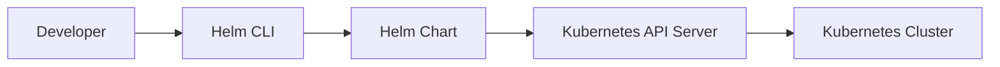

### Working Steps

1. Developer creates or downloads a Helm Chart.
2. Helm CLI renders templates using values.
3. Helm generates Kubernetes manifests.
4. Kubernetes API Server receives the manifests.
5. Kubernetes creates or updates resources.

---

## Key Components

| Component | Description |
|------------|-------------|
| Helm CLI | Command-line tool used to install and manage charts |
| Chart | Package containing Kubernetes manifests |
| Templates | YAML templates with variables |
| Values File | Stores configurable parameters |
| Release | Running instance of a Helm chart |
| Repository | Storage location for Helm charts |
| Kubernetes Cluster | Deployment target |

---

## Types (if applicable)

### Helm Chart Types

| Type | Description |
|------|-------------|
| Application Chart | Deploys an application |
| Library Chart | Reusable templates for other charts |

---

## Lifecycle / Workflow

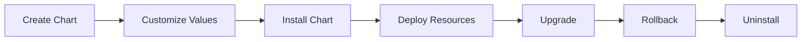

---

## Configuration / Syntax

Basic Helm workflow

```text
Chart
   │
   ▼
Values.yaml
   │
   ▼
Template Rendering
   │
   ▼
Generated Kubernetes YAML
   │
   ▼
Kubernetes Cluster
```

---

## Important Commands

### Install Helm

```bash
helm version
```

---

### Search Charts

```bash
helm search repo nginx
```

---

### Install Chart

```bash
helm install my-app bitnami/nginx
```

---

### List Releases

```bash
helm list
```

---

### Upgrade Release

```bash
helm upgrade my-app bitnami/nginx
```

---

### Rollback Release

```bash
helm rollback my-app 1
```

---

### Uninstall Release

```bash
helm uninstall my-app
```

---

### Show Values

```bash
helm show values bitnami/nginx
```

---

## Important Files

```
Chart.yaml

values.yaml

templates/

templates/deployment.yaml

templates/service.yaml

templates/ingress.yaml

charts/

README.md
```

---

## Real-World Use Cases

- Deploy NGINX
- Deploy Prometheus
- Deploy Grafana
- Deploy Argo CD
- Deploy Jenkins
- Deploy Elasticsearch
- Deploy Redis
- Deploy MySQL
- Deploy Kubernetes applications
- CI/CD deployments using Helm

---

## Advantages

- Simplifies Kubernetes deployments
- Reusable application packages
- Supports versioning
- Easy upgrades
- Easy rollbacks
- Environment-specific configuration
- Reduces YAML duplication
- Widely supported by Kubernetes ecosystem

---

## Limitations

- Learning curve for templates
- Template debugging can be difficult
- Poor chart design leads to maintenance issues
- Large charts become complex
- Requires Kubernetes knowledge

---

## Common Interview Questions (Concept Only)

- What is Helm?
- Why do we use Helm?
- What is a Helm Chart?
- What is a Helm Release?
- What is the difference between a Chart and a Release?
- How does Helm simplify Kubernetes deployments?
- What is the purpose of values.yaml?
- What are Helm templates?
- What is a Helm Repository?
- How do upgrades and rollbacks work in Helm?
- What is the difference between Helm v2 and Helm v3?

---

## Common Mistakes

- Editing generated Kubernetes resources directly instead of updating the chart
- Hardcoding configuration inside templates
- Not using `values.yaml` for customization
- Forgetting to version charts
- Ignoring rollback testing
- Using one chart for unrelated applications
- Not validating templates before deployment

---

## Troubleshooting

| Problem | Cause | Solution |
|----------|-------|----------|
| Chart installation fails | Invalid templates | Validate chart using `helm lint` |
| Template rendering error | Incorrect variables | Verify template syntax and values |
| Upgrade failed | Invalid configuration | Compare values and manifests |
| Release not found | Wrong release name | Check `helm list` |
| Resources not updated | Old values reused | Verify upgrade parameters |
| Kubernetes errors | Invalid manifests | Validate generated YAML |

---

## Summary

Helm is the standard package manager for Kubernetes that simplifies application deployment, upgrades, rollbacks, and configuration management using reusable Helm Charts. It significantly reduces manual YAML management and is widely used in production Kubernetes environments.

> **Interview Tip**
>
> Remember the relationship:
>
> - **Chart** → Package
> - **Release** → Installed instance of the package
> - **Repository** → Collection of charts
> - **Values** → Configuration for templates

---

# What is Helm

## Overview

Helm is an open-source package manager for Kubernetes that packages Kubernetes manifests into reusable **Helm Charts**. It automates installation, upgrades, rollbacks, and lifecycle management of Kubernetes applications.

---

## Why It Is Used

- Simplifies Kubernetes deployments
- Manages application versions
- Supports reusable templates
- Reduces YAML duplication

---

## Architecture / Working

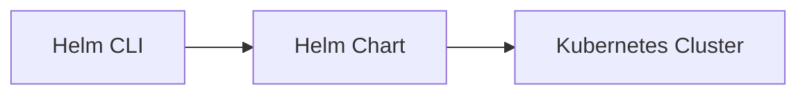

---

## Key Components

- Helm CLI
- Chart
- Release
- Repository

---

## Types (if applicable)

- Application Charts
- Library Charts

---

## Lifecycle / Workflow

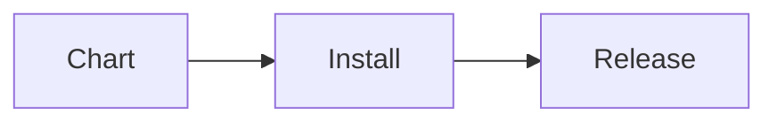

---

## Configuration / Syntax

```bash
helm install
```

---

## Important Commands

```bash
helm version
```

---

## Important Files

```
Chart.yaml
```

---

## Real-World Use Cases

- Deploy enterprise applications
- Kubernetes package management

---

## Advantages

- Faster deployments
- Standardized packaging

---

## Limitations

- Requires Kubernetes

---

## Common Interview Questions (Concept Only)

- What is Helm?
- Why is Helm called the package manager for Kubernetes?

---

## Common Mistakes

- Treating Helm as a Kubernetes replacement

---

## Troubleshooting

- Verify Helm installation

---

## Summary

Helm packages Kubernetes applications into reusable charts and simplifies their lifecycle management.

---

# Why Helm

## Overview

Managing dozens of Kubernetes YAML files manually is difficult. Helm solves this problem by providing reusable templates and centralized configuration.

---

## Why It Is Used

Without Helm:

- Multiple YAML files
- Duplicate configurations
- Difficult upgrades
- Manual rollbacks

With Helm:

- Single installation command
- Template reuse
- Version management
- Automated rollback

---

## Architecture / Working

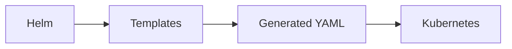

---

## Key Components

- Templates
- Values
- Charts

---

## Types (if applicable)

Not applicable.

---

## Lifecycle / Workflow

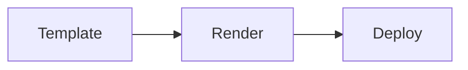

---

## Configuration / Syntax

Uses templates and values.

---

## Important Commands

```bash
helm install
```

---

## Important Files

```
values.yaml
```

---

## Real-World Use Cases

- Environment-specific deployments
- Enterprise Kubernetes platforms

---

## Advantages

- Less duplication
- Easier upgrades

---

## Limitations

- Requires chart maintenance

---

## Common Interview Questions (Concept Only)

- Why use Helm instead of raw YAML?

---

## Common Mistakes

- Ignoring reusable templates

---

## Troubleshooting

- Validate templates

---

## Summary

Helm reduces complexity by replacing repetitive Kubernetes manifests with reusable templates.

---

# Helm Architecture

## Overview

Helm uses a client-only architecture (Helm v3). The Helm CLI communicates directly with the Kubernetes API Server.

---

## Why It Is Used

Provides a simple deployment mechanism without additional server-side components.

---

## Architecture / Working

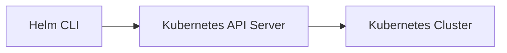

---

## Key Components

| Component | Purpose |
|-----------|----------|
| Helm CLI | User interface |
| Kubernetes API | Resource management |
| Cluster | Deployment target |

---

## Types (if applicable)

- Helm v3 Architecture

---

## Lifecycle / Workflow

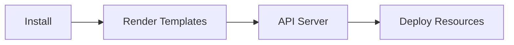

---

## Configuration / Syntax

Not applicable.

---

## Important Commands

```bash
helm install
```

---

## Important Files

```
Chart.yaml
```

---

## Real-World Use Cases

- Kubernetes deployments

---

## Advantages

- Simple architecture

---

## Limitations

- Requires Kubernetes API access

---

## Common Interview Questions (Concept Only)

- Explain Helm architecture.

---

## Common Mistakes

- Assuming Tiller exists in Helm v3

---

## Troubleshooting

- Verify Kubernetes connectivity

---

## Summary

Helm v3 communicates directly with Kubernetes without requiring Tiller.

---

# Helm Components

## Overview

Helm consists of several components that work together to package and deploy applications.

---

## Why It Is Used

Each component has a specific responsibility.

---

## Architecture / Working

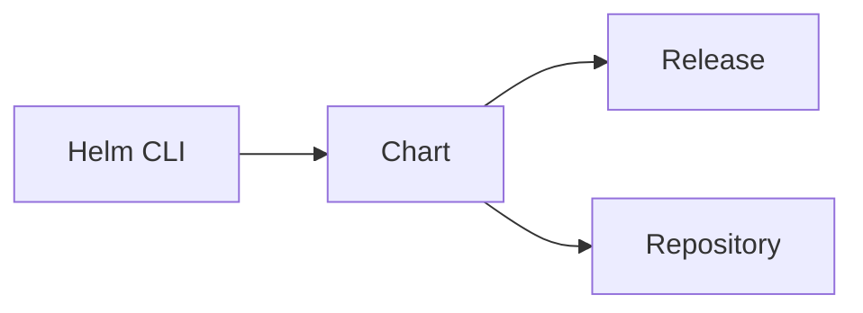

---

## Key Components

| Component | Purpose |
|-----------|----------|
| CLI | Executes commands |
| Chart | Application package |
| Release | Installed application |
| Repository | Chart storage |
| Values | Configuration |

---

## Types (if applicable)

- Local Repository
- Remote Repository

---

## Lifecycle /Workflow


---

## Configuration / Syntax

Not applicable.

---

## Important Commands

```bash
helm repo add
```

---

## Important Files

```
Chart.yaml

values.yaml
```

---

## Real-World Use Cases

- Enterprise application deployment

---

## Advantages

- Modular design

---

## Limitations

- Component dependency

---

## Common Interview Questions (Concept Only)

- What are Helm components?

---

## Common Mistakes

- Confusing charts with releases

---

## Troubleshooting

- Verify repository configuration

---

## Summary

Helm components work together to package, configure, and deploy Kubernetes applications.

---

# Helm Workflow

## Overview

The Helm workflow describes how an application is packaged, configured, deployed, upgraded, and removed.

---

## Why It Is Used

Provides a standardized deployment lifecycle.

---

## Architecture / Working

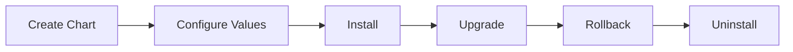

---

## Key Components

- Chart
- Values
- Release

---

## Types (if applicable)

Not applicable.

---

## Lifecycle / Workflow

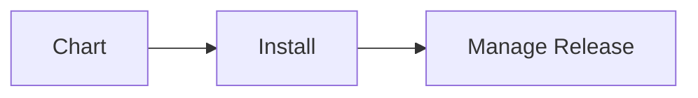

---

## Configuration / Syntax

Uses Helm commands.

---

## Important Commands

```bash
helm install

helm upgrade

helm rollback

helm uninstall
```

---

## Important Files

```
Chart.yaml

values.yaml
```

---

## Real-World Use Cases

- CI/CD deployments
- Kubernetes upgrades

---

## Advantages

- Complete lifecycle management

---

## Limitations

- Requires chart version management

---

## Common Interview Questions (Concept Only)

- Explain the Helm workflow.

---

## Common Mistakes

- Skipping rollback testing

---

## Troubleshooting

- Verify release status

---

## Summary

The Helm workflow manages the complete lifecycle of Kubernetes applications.

---

# Helm v2 vs Helm v3

## Overview

Helm v3 is the current version and removed **Tiller**, making Helm more secure and easier to use.

---

## Why It Is Used

Helm v3 simplifies deployment and improves security.

---

## Architecture / Working

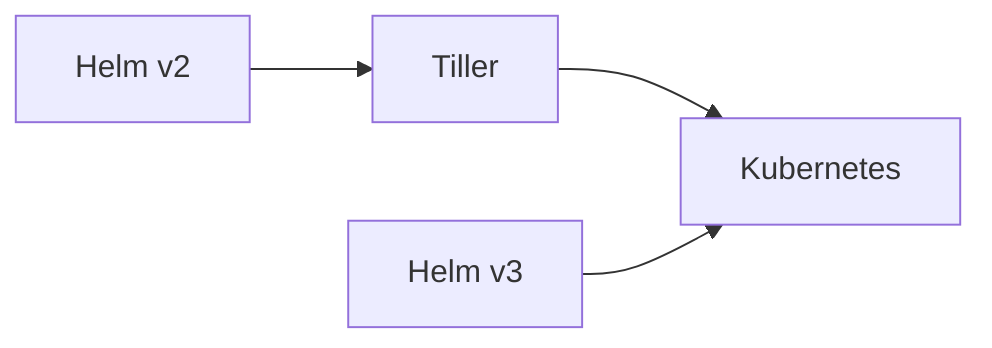

---

## Key Components

| Version | Architecture |
|----------|-------------|
| Helm v2 | Client + Tiller |
| Helm v3 | Client only |

---

## Types (if applicable)

- Helm v2
- Helm v3

---

## Lifecycle / Workflow

Same deployment workflow with simplified architecture in Helm v3.

---

## Configuration / Syntax

Commands are mostly unchanged.

---

## Important Commands

```bash
helm version
```

---

## Important Files

Same chart structure.

---

## Real-World Use Cases

All modern Kubernetes clusters use Helm v3.

---

## Advantages

| Helm v2 | Helm v3 |
|----------|----------|
| Requires Tiller | No Tiller |
| Less secure | More secure |
| Complex RBAC | Simplified RBAC |
| Server component | Client only |

---

## Limitations

Helm v2 is deprecated.

---

## Common Interview Questions (Concept Only)

- What is Tiller?
- Why was Tiller removed?
- Difference between Helm v2 and Helm v3?

---

## Common Mistakes

- Assuming Helm v3 still uses Tiller.

---

## Troubleshooting

- Verify Helm version using `helm version`.

---

## Summary

Helm v3 removed Tiller, resulting in a simpler, more secure architecture. Nearly all production Kubernetes environments now use Helm v3.

---

# Interview Quick Revision

## Helm Core Concepts

| Concept | Description |
|----------|-------------|
| Helm | Kubernetes package manager |
| Chart | Package containing Kubernetes resources |
| Release | Installed instance of a chart |
| Repository | Collection of Helm charts |
| Values | Configuration passed to templates |
| Templates | Dynamic Kubernetes YAML files |

---

## Helm v2 vs Helm v3

| Feature | Helm v2 | Helm v3 |
|---------|----------|----------|
| Tiller | Yes | No |
| Security | Lower | Higher |
| Architecture | Client + Server | Client Only |
| RBAC Complexity | High | Lower |
| Current Usage | Deprecated | Standard |

---

## Production Best Practices

- Use Helm v3 for all new deployments.
- Store custom configuration in `values.yaml` instead of modifying templates directly.
- Version Helm charts and test upgrades before production deployments.
- Validate charts with `helm lint` before installation.
- Use `helm upgrade` for updates and verify rollback procedures.
- Keep charts modular and reusable across environments.

---

## One-line Interview Answer

**Helm is the package manager for Kubernetes that packages applications into reusable charts, enabling consistent deployments, simplified upgrades, easy rollbacks, and environment-specific configuration management through templates and values files.**
