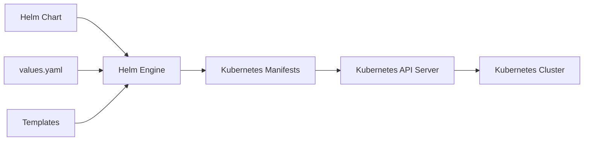
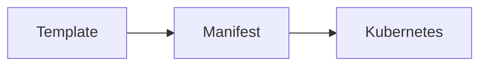
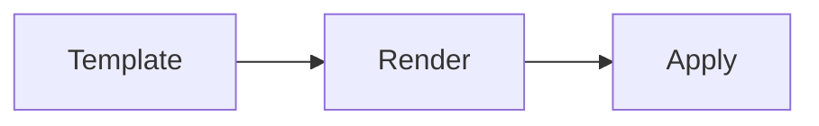
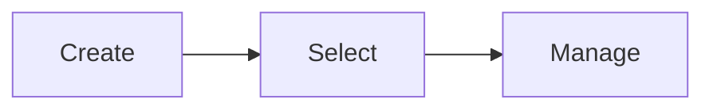
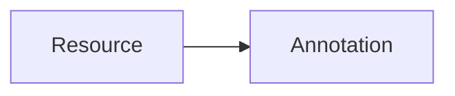
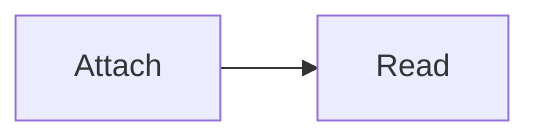
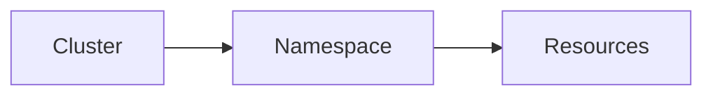
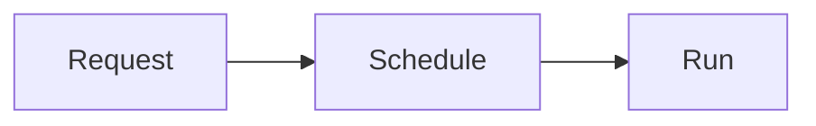

# Kubernetes Integration

## Overview

Helm integrates tightly with Kubernetes by generating and deploying **Kubernetes manifests** from reusable templates. Instead of manually writing and maintaining static YAML files, Helm uses templates and values to dynamically create Kubernetes resources.

Helm supports all standard Kubernetes resources such as Deployments, Services, ConfigMaps, Secrets, Ingresses, Jobs, CronJobs, and PersistentVolumeClaims.

> **Interview Tip**
>
> Helm is **not** a replacement for Kubernetes. It is a **package manager** that generates and manages Kubernetes manifests.

---

## Why It Is Used

Kubernetes Integration helps to:

- Automate Kubernetes deployments
- Reuse deployment templates
- Manage multiple environments
- Reduce YAML duplication
- Simplify upgrades and rollbacks
- Standardize application deployments
- Improve CI/CD automation

---

## Architecture / Working



### Working Process

1. User installs a Helm Chart.
2. Helm reads templates and values.
3. Templates are rendered into Kubernetes manifests.
4. Helm sends manifests to the Kubernetes API Server.
5. Kubernetes creates and manages the resources.
6. Helm tracks the deployment as a Release.

---

## Key Components

| Component | Purpose |
|-----------|----------|
| Kubernetes Manifests | Define Kubernetes resources |
| Labels | Resource identification |
| Annotations | Metadata for tools |
| Namespace | Resource isolation |
| Resource Requests | Minimum guaranteed resources |
| Resource Limits | Maximum allowed resources |

---

## Types (if applicable)

| Resource Type | Purpose |
|--------------|----------|
| Workloads | Deployment, StatefulSet, DaemonSet |
| Networking | Service, Ingress |
| Configuration | ConfigMap, Secret |
| Storage | PersistentVolumeClaim |

---

## Lifecycle / Workflow

```mermaid
flowchart LR

Chart
   │
   ▼
Templates
   │
   ▼
Render Manifests
   │
   ▼
API Server
   │
   ▼
Deploy Resources
```

---

## Configuration / Syntax (if applicable)

Typical template

```yaml
metadata:
  labels:
    app: {{ .Chart.Name }}
```

---

## Important Commands (if applicable)

```bash
helm install

helm upgrade

helm template

helm get manifest

kubectl get all

kubectl describe
```

---

## Important Files (if applicable)

```
Chart.yaml

values.yaml

templates/
```

---

## Real-World Use Cases

- Deploy microservices
- Multi-environment deployments
- GitOps
- CI/CD pipelines
- Kubernetes automation

---

## Advantages

- Reusable templates
- Environment-specific configuration
- Easy upgrades
- Version-controlled deployments
- Reduced manual work

---

## Limitations

- Requires Kubernetes knowledge
- Complex templates become difficult to debug
- Incorrect values affect generated manifests

---

## Common Interview Questions (Concept Only)

- How does Helm integrate with Kubernetes?
- Does Helm create Kubernetes resources directly?
- What is rendered before deployment?
- Does Helm replace kubectl?
- What resources can Helm deploy?

---

## Common Mistakes

- Hardcoding resource names
- Missing labels
- Incorrect namespaces
- Invalid YAML indentation
- Ignoring resource limits

---

## Troubleshooting

| Problem | Cause | Solution |
|----------|-------|----------|
| Resources not created | Invalid manifest | Run `helm template` |
| Pods Pending | Resource constraints | Verify requests and limits |
| Wrong namespace | Namespace mismatch | Specify namespace correctly |
| Service unavailable | Label mismatch | Verify selectors |
| Deployment failed | Invalid YAML | Validate templates |

---

## Summary

Helm integrates with Kubernetes by rendering templates into Kubernetes manifests and deploying them through the Kubernetes API Server.

> **Interview Tip**
>
> Helm **generates manifests**, while Kubernetes **creates and manages resources**.

---

# Kubernetes Manifests

## Overview

Kubernetes Manifests are YAML files that describe the desired state of Kubernetes resources.

Helm templates generate these manifests dynamically.

---

## Why It Is Used

- Define Kubernetes resources
- Enable declarative deployments
- Automate infrastructure

---

## Architecture / Working



---

## Key Components

- apiVersion
- kind
- metadata
- spec

---

## Types (if applicable)

- Deployment
- Service
- ConfigMap
- Secret
- Ingress

---

## Lifecycle / Workflow



---

## Configuration / Syntax (if applicable)

```yaml
apiVersion: apps/v1
kind: Deployment
```

---

## Important Commands (if applicable)

```bash
helm template

kubectl apply
```

---

## Important Files (if applicable)

```
templates/
```

---

## Real-World Use Cases

- Deploy applications
- Infrastructure automation

---

## Advantages

- Declarative deployments

---

## Limitations

- YAML syntax sensitive

---

## Common Interview Questions (Concept Only)

- What is a Kubernetes Manifest?

---

## Common Mistakes

- Invalid indentation

---

## Troubleshooting

Validate rendered YAML.

---

## Summary

Helm generates Kubernetes manifests from templates.

---

# Labels

## Overview

Labels are key-value pairs attached to Kubernetes resources for identification and selection.

---

## Why It Is Used

- Resource grouping
- Service discovery
- Pod selection
- Monitoring

---

## Architecture / Working

```mermaid
flowchart LR

Deployment --> Labels
Service --> Select Labels
```

---

## Key Components

- Key
- Value

---

## Types (if applicable)

User-defined labels

---

## Lifecycle / Workflow



---

## Configuration / Syntax (if applicable)

```yaml
labels:
  app: nginx
```

---

## Important Commands (if applicable)

```bash
kubectl get pods --show-labels
```

---

## Important Files (if applicable)

```
templates/
```

---

## Real-World Use Cases

- Environment labels
- Application labels

---

## Advantages

- Easy resource selection

---

## Limitations

- Incorrect labels break Services

---

## Common Interview Questions (Concept Only)

- Labels vs Selectors?

---

## Common Mistakes

- Inconsistent labels

---

## Troubleshooting

Verify labels and selectors.

---

## Summary

Labels uniquely identify Kubernetes resources.

---

# Annotations

## Overview

Annotations are metadata attached to Kubernetes resources.

Unlike labels, they are **not used for resource selection**.

---

## Why It Is Used

- Store metadata
- Tool integration
- Documentation

---

## Architecture / Working



---

## Key Components

- Key
- Value

---

## Types (if applicable)

Metadata

---

## Lifecycle / Workflow



---

## Configuration / Syntax (if applicable)

```yaml
annotations:
  owner: devops
```

---

## Important Commands (if applicable)

```bash
kubectl describe
```

---

## Important Files (if applicable)

Templates

---

## Real-World Use Cases

- Ingress configuration
- Monitoring

---

## Advantages

- Flexible metadata

---

## Limitations

- Cannot select resources

---

## Common Interview Questions (Concept Only)

- Labels vs Annotations?

---

## Common Mistakes

- Using annotations as labels

---

## Troubleshooting

Inspect resource metadata.

---

## Summary

Annotations provide additional metadata for Kubernetes resources.

---

# Namespaces

## Overview

Namespaces logically separate Kubernetes resources within a cluster.

Helm releases are installed into namespaces.

---

## Why It Is Used

- Resource isolation
- Multi-tenancy
- Environment separation

---

## Architecture / Working



---

## Key Components

- Namespace
- Resources

---

## Types (if applicable)

- default
- kube-system
- custom

---

## Lifecycle / Workflow

```mermaid
flowchart LR

Create Namespace --> Deploy
```

---

## Configuration / Syntax (if applicable)

```bash
helm install myapp . --namespace production
```

---

## Important Commands (if applicable)

```bash
kubectl get ns

helm install --namespace
```

---

## Important Files (if applicable)

Namespace manifest

---

## Real-World Use Cases

- Dev
- QA
- Production

---

## Advantages

- Resource isolation

---

## Limitations

- Names are unique within namespace

---

## Common Interview Questions (Concept Only)

- Why use namespaces?

---

## Common Mistakes

- Deploying to wrong namespace

---

## Troubleshooting

Verify namespace.

---

## Summary

Namespaces isolate Kubernetes resources.

---

# Resource Limits

## Overview

Resource Limits define the **maximum CPU and memory** a container can consume.

If a container exceeds its memory limit, Kubernetes may terminate (OOMKill) it. CPU usage beyond the limit is throttled.

---

## Why It Is Used

- Prevent resource exhaustion
- Improve cluster stability
- Fair resource sharing

---

## Architecture / Working

```mermaid
flowchart LR

Pod --> CPU Limit
Pod --> Memory Limit
```

---

## Key Components

- CPU
- Memory

---

## Types (if applicable)

Container limits

---

## Lifecycle / Workflow

```mermaid
flowchart LR

Schedule --> Run --> Enforce Limit
```

---

## Configuration / Syntax (if applicable)

```yaml
resources:
  limits:
    cpu: "500m"
    memory: "512Mi"
```

---

## Important Commands (if applicable)

```bash
kubectl describe pod
```

---

## Important Files (if applicable)

Deployment template

---

## Real-World Use Cases

- Production workloads

---

## Advantages

- Prevents noisy neighbors
- Protects cluster resources

---

## Limitations

- Incorrect limits may cause OOMKilled or CPU throttling

---

## Common Interview Questions (Concept Only)

- What happens when memory limit is exceeded?

---

## Common Mistakes

- Setting limits too low

---

## Troubleshooting

Check Pod events.

---

## Summary

Limits define the maximum resources a container may consume.

---

# Resource Requests

## Overview

Resource Requests define the **minimum CPU and memory** required by a container.

The Kubernetes scheduler uses these values to determine on which node the Pod can be placed.

---

## Why It Is Used

- Scheduling
- Resource planning
- Guaranteed allocation

---

## Architecture / Working

```mermaid
flowchart LR

Scheduler --> Resource Request --> Node
```

---

## Key Components

- CPU
- Memory

---

## Types (if applicable)

Guaranteed resources

---

## Lifecycle / Workflow



---

## Configuration / Syntax (if applicable)

```yaml
resources:
  requests:
    cpu: "200m"
    memory: "256Mi"
```

---

## Important Commands (if applicable)

```bash
kubectl describe pod
```

---

## Important Files (if applicable)

Deployment template

---

## Real-World Use Cases

- Capacity planning
- Production workloads

---

## Advantages

- Predictable scheduling

---

## Limitations

- Excessive requests reduce cluster utilization

---

## Common Interview Questions (Concept Only)

- Difference between requests and limits?

---

## Common Mistakes

- Requests greater than limits
- Overestimating requests

---

## Troubleshooting

Review scheduler events.

---

## Summary

Requests define the minimum resources required for scheduling containers.

---

# Interview Quick Revision

## Kubernetes Resources Managed by Helm

| Resource | Purpose |
|----------|---------|
| Deployment | Manage Pods |
| Service | Expose Pods |
| ConfigMap | Non-sensitive configuration |
| Secret | Sensitive data |
| Ingress | HTTP/HTTPS routing |
| PVC | Persistent storage |

---

## Labels vs Annotations

| Labels | Annotations |
|----------|-------------|
| Used for resource selection | Not used for selection |
| Indexed by Kubernetes | Metadata only |
| Small key-value pairs | Can store larger metadata |
| Used by Services and Deployments | Used by tools and controllers |

---

## Resource Requests vs Limits

| Requests | Limits |
|-----------|--------|
| Minimum required resources | Maximum allowed resources |
| Used for Pod scheduling | Enforced during runtime |
| Guarantees resource reservation | Prevents excessive resource usage |

---

## Frequently Used Commands

| Command | Purpose |
|----------|---------|
| `helm template` | Render manifests locally |
| `helm install` | Deploy resources |
| `helm get manifest` | View deployed manifests |
| `kubectl get all` | List resources |
| `kubectl describe` | Inspect resources |
| `kubectl get ns` | List namespaces |

---

## Production Best Practices

- Parameterize manifests using `values.yaml`.
- Use consistent labels for Services, Deployments, and monitoring tools.
- Store operational metadata in annotations, not labels.
- Deploy applications into dedicated namespaces for environment isolation.
- Define both resource requests and limits for all production workloads.
- Keep requests realistic to avoid scheduling issues and limits high enough to prevent unnecessary throttling or OOMKills.
- Validate rendered manifests with `helm template` before deploying to a cluster.

---

## One-line Interview Answer

**Helm integrates with Kubernetes by rendering parameterized templates into Kubernetes manifests and deploying them through the Kubernetes API Server, enabling consistent, reusable, and version-controlled management of Kubernetes resources.**
