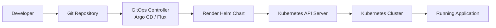
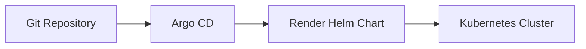
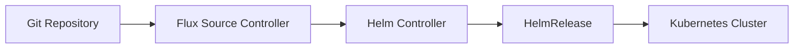
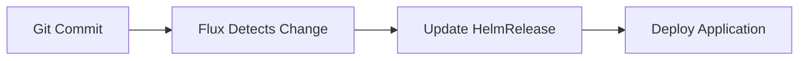
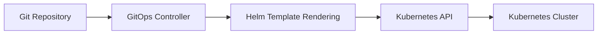
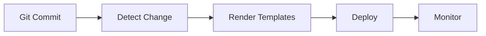

# GitOps Integration

## Overview

GitOps Integration combines **Helm** with **GitOps tools** like **Argo CD** and **Flux** to automate Kubernetes deployments.

In GitOps:

- Git stores the desired state of the application.
- Helm packages and templates Kubernetes resources.
- GitOps controllers continuously monitor Git repositories.
- Any change committed to Git is automatically synchronized with Kubernetes.

Unlike traditional CI/CD (push-based deployments), GitOps follows a **pull-based deployment model**, where the Kubernetes cluster continuously pulls changes from Git.

> **Interview Tip**
>
> **Helm is a package manager and templating engine.**
> **Argo CD and Flux are GitOps controllers.**
>
> Helm **does not perform GitOps** by itself.

---

## Why It Is Used

GitOps with Helm is used to:

- Automate Kubernetes deployments
- Keep Git as the single source of truth
- Reduce manual deployments
- Detect configuration drift
- Enable automatic synchronization
- Improve deployment consistency
- Support self-healing applications
- Simplify rollback using Git history

---

## Architecture / Working



### Working Process

1. Developer updates Helm Chart or values file.
2. Changes are committed to Git.
3. GitOps controller detects repository changes.
4. Helm templates are rendered into Kubernetes manifests.
5. Manifests are applied to the cluster.
6. Cluster state is continuously compared with Git.
7. Drift is automatically corrected if enabled.

---

## Key Components

| Component | Purpose |
|-----------|----------|
| Git Repository | Stores desired application state |
| Helm Chart | Packages Kubernetes resources |
| Values Files | Environment-specific configuration |
| GitOps Controller | Monitors Git and synchronizes cluster |
| Kubernetes API | Applies rendered manifests |
| Kubernetes Cluster | Runs workloads |

---

## Types (if applicable)

| Integration | Purpose |
|-------------|----------|
| Helm + Argo CD | GitOps Continuous Delivery |
| Helm + Flux | Kubernetes-native GitOps |
| Declarative Deployment | Desired-state deployment |
| Pull-Based Deployment | Continuous synchronization |

---

## Lifecycle / Workflow


---

## Configuration / Syntax (if applicable)

Render Helm templates locally:

```bash
helm template myapp ./chart
```

Typical GitOps deployment:

- GitOps controller references a Helm chart.
- Helm renders Kubernetes manifests.
- Controller applies manifests to the cluster.

---

## Important Commands (if applicable)

```bash
helm template

helm lint

helm package

helm dependency update

argocd app sync

argocd app get

flux reconcile source git

flux reconcile helmrelease
```

---

## Important Files (if applicable)

```
Chart.yaml

values.yaml

values-dev.yaml

values-prod.yaml

templates/

Application.yaml        # Argo CD

HelmRelease.yaml        # Flux

Git Repository
```

---

## Real-World Use Cases

- GitOps-based Kubernetes deployments
- Multi-cluster management
- Production Continuous Delivery
- Infrastructure as Code
- Automated rollback
- Self-healing deployments
- Environment-specific deployments

---

## Advantages

- Git becomes the single source of truth
- Automated deployments
- Consistent environments
- Easy rollback using Git history
- Drift detection
- Self-healing
- Audit trail through Git commits
- Supports multi-cluster deployments

---

## Limitations

- Requires GitOps tools
- Learning curve for GitOps concepts
- Manual cluster changes are overwritten
- Git repository availability is critical
- Requires proper repository organization

---

## Common Interview Questions (Concept Only)

- What is GitOps?
- How does Helm support GitOps?
- Can Helm perform GitOps by itself?
- What is the difference between CI/CD and GitOps?
- Why is Git called the source of truth?
- What is pull-based deployment?
- How does drift detection work?
- What is declarative deployment?
- Difference between Argo CD and Flux?
- Why use Helm with GitOps?

---

## Common Mistakes

- Editing Kubernetes resources manually
- Using mutable image tags like `latest`
- Hardcoding production values
- Treating Helm as a GitOps controller
- Storing secrets directly in Git
- Ignoring synchronization failures

---

## Troubleshooting

| Problem | Cause | Solution |
|----------|-------|----------|
| Application OutOfSync | Git differs from cluster | Synchronize application |
| Sync failed | Invalid Helm chart | Run `helm lint` |
| Template rendering failed | Invalid values | Verify values files |
| Image not updated | Mutable image tag | Use versioned image tags |
| Drift repeatedly detected | Manual cluster changes | Update Git instead of cluster |
| Deployment failed | Kubernetes validation error | Inspect rendered manifests and cluster events |

---

## Summary

GitOps Integration combines Helm with GitOps controllers to automate Kubernetes deployments using Git as the single source of truth. Helm renders application manifests, while GitOps controllers continuously synchronize the cluster to match the desired state stored in Git.

> **Interview Tip**
>
> **Helm packages applications.**
>
> **Argo CD and Flux deploy them using GitOps.**

---

# Helm with Argo CD

## Overview

Argo CD is a GitOps Continuous Delivery tool that deploys **Helm Charts directly from Git repositories**.

Argo CD continuously monitors Git and automatically synchronizes Kubernetes clusters.

> **Important Interview Point**
>
> Argo CD **uses Helm as a template engine**.
>
> It **does not execute** `helm install` or manage Helm releases like the Helm CLI.

---

## Why It Is Used

- Continuous Delivery
- GitOps deployments
- Drift detection
- Self-healing
- Automated synchronization

---

## Architecture / Working



---

## Key Components

| Component | Purpose |
|-----------|----------|
| Git Repository | Stores Helm charts |
| Argo CD | GitOps controller |
| Helm | Template rendering |
| Kubernetes Cluster | Deployment target |

---

## Types (if applicable)

- GitOps Continuous Delivery

---

## Lifecycle / Workflow


---

## Configuration / Syntax (if applicable)

Argo CD references a Helm chart in an `Application` resource.

---

## Important Commands (if applicable)

```bash
argocd app create

argocd app sync

argocd app get

argocd app history
```

---

## Important Files (if applicable)

```
Application.yaml

Chart.yaml

values.yaml
```

---

## Real-World Use Cases

- AKS deployments
- EKS deployments
- GKE deployments
- Multi-cluster GitOps

---

## Advantages

- Continuous synchronization
- Drift detection
- Self-healing
- Git-based auditing

---

## Limitations

- Requires Argo CD installation
- Git repository must remain available

---

## Common Interview Questions (Concept Only)

- Does Argo CD execute Helm commands?
- How does Argo CD deploy Helm charts?
- What is the Application resource?

---

## Common Mistakes

- Treating Argo CD as a Helm release manager
- Making manual cluster changes

---

## Troubleshooting

- Verify Git connectivity.
- Check application synchronization status.
- Validate Helm templates.

---

## Summary

Argo CD continuously synchronizes Kubernetes clusters by rendering Helm charts stored in Git repositories.

---

# Helm with Flux

## Overview

Flux is a Kubernetes-native GitOps tool that manages Helm deployments using the **Helm Controller**.

Flux deploys applications declaratively through the **HelmRelease** custom resource.

> **Interview Tip**
>
> Flux manages Helm deployments using **HelmRelease**, not manual Helm CLI commands.

---

## Why It Is Used

- Kubernetes-native GitOps
- Automated deployments
- Continuous synchronization
- Declarative Helm management

---

## Architecture / Working



---

## Key Components

| Component | Purpose |
|-----------|----------|
| Source Controller | Watches Git |
| Helm Controller | Manages Helm releases |
| HelmRelease | Defines deployment |
| Kubernetes | Runs workloads |

---

## Types (if applicable)

- GitOps deployment

---

## Lifecycle / Workflow



---

## Configuration / Syntax (if applicable)

Flux deploys applications using:

```
HelmRelease.yaml
```

---

## Important Commands (if applicable)

```bash
flux reconcile source git

flux reconcile helmrelease

flux get helmreleases
```

---

## Important Files (if applicable)

```
HelmRelease.yaml
```

---

## Real-World Use Cases

- Enterprise Kubernetes
- Multi-cluster deployments
- Continuous Delivery

---

## Advantages

- Kubernetes-native
- Automated reconciliation
- Git-based deployment

---

## Limitations

- Requires Flux components
- Additional CRDs

---

## Common Interview Questions (Concept Only)

- What is HelmRelease?
- How does Flux deploy Helm charts?

---

## Common Mistakes

- Editing resources manually

---

## Troubleshooting

Verify HelmRelease status and Git synchronization.

---

## Summary

Flux continuously deploys Helm charts using the Helm Controller and HelmRelease resources.

---

# Declarative Deployments

## Overview

Declarative Deployment means defining the desired application state in configuration files instead of manually executing deployment commands.

Helm templates generate Kubernetes manifests from declarative YAML configuration.

---

## Why It Is Used

- Predictable deployments
- Version control
- Automation
- Easy rollback

---

## Architecture / Working


---

## Key Components

| Component | Purpose |
|-----------|----------|
| YAML | Desired state |
| Helm Chart | Templates |
| Git | Version control |

---

## Types (if applicable)

- Desired-state deployment

---

## Lifecycle / Workflow


---

## Configuration / Syntax (if applicable)

Helm templates render declarative Kubernetes manifests.

---

## Important Commands (if applicable)

```bash
helm template
```

---

## Important Files (if applicable)

```
Chart.yaml

values.yaml
```

---

## Real-World Use Cases

- Infrastructure as Code
- Kubernetes deployments

---

## Advantages

- Repeatable deployments
- Easy auditing
- Predictable environments

---

## Limitations

- Requires disciplined Git workflow

---

## Common Interview Questions (Concept Only)

- What is declarative deployment?
- How is it different from imperative deployment?

---

## Common Mistakes

- Mixing imperative and declarative changes

---

## Troubleshooting

Compare Git with cluster state.

---

## Summary

Declarative deployments define the desired Kubernetes state through version-controlled configuration files.

---

# Helm in GitOps Workflows

## Overview

In GitOps workflows, Helm acts as the application packaging and templating layer, while GitOps controllers automate deployment and synchronization.

Helm generates Kubernetes manifests from charts, and GitOps controllers ensure the cluster always matches the desired state stored in Git.

---

## Why It Is Used

- Automated Kubernetes deployments
- Continuous synchronization
- Version-controlled infrastructure
- Simplified release management

---

## Architecture / Working



---

## Key Components

| Component | Purpose |
|-----------|----------|
| Git | Source of truth |
| Helm | Package manager |
| GitOps Controller | Synchronization |
| Kubernetes | Application platform |

---

## Types (if applicable)

- Pull-based deployment

---

## Lifecycle / Workflow



---

## Configuration / Syntax (if applicable)

GitOps controllers reference Helm charts directly from Git repositories.

---

## Important Commands (if applicable)

```bash
helm template

helm lint

argocd app sync

flux reconcile helmrelease
```

---

## Important Files (if applicable)

```
Chart.yaml

values.yaml

Application.yaml

HelmRelease.yaml
```

---

## Real-World Use Cases

- Enterprise GitOps
- Multi-cluster deployments
- Platform engineering
- Continuous Delivery

---

## Advantages

- Automated synchronization
- Git-based auditing
- Drift detection
- Self-healing

---

## Limitations

- Requires GitOps tooling
- Strong Git discipline required

---

## Common Interview Questions (Concept Only)

- Where does Helm fit into GitOps?
- Why combine Helm with Argo CD or Flux?
- What is the role of Git in GitOps?

---

## Common Mistakes

- Treating Git as backup instead of the source of truth
- Manual changes directly in Kubernetes

---

## Troubleshooting

Verify:

- Git synchronization
- Rendered Helm manifests
- Controller status
- Kubernetes events

---

## Summary

Helm provides reusable application packaging, while GitOps tools like Argo CD and Flux automate deployment and continuously enforce the desired state stored in Git.

---

# Interview Quick Revision

## GitOps Deployment Workflow


---

## CI/CD vs GitOps

| CI/CD | GitOps |
|--------|--------|
| Push-based deployment | Pull-based deployment |
| Pipeline executes deployment | GitOps controller synchronizes cluster |
| Triggered by pipeline | Triggered by Git changes |
| Jenkins, GitHub Actions, Azure DevOps | Argo CD, Flux |

---

## Helm + GitOps Responsibilities

| Component | Responsibility |
|-----------|----------------|
| Helm | Package and render Kubernetes manifests |
| Git | Store desired application state |
| Argo CD | Synchronize cluster from Git |
| Flux | Manage Helm releases declaratively |
| Kubernetes | Run workloads |

---

## Argo CD vs Flux

| Argo CD | Flux |
|----------|------|
| Uses `Application` resource | Uses `HelmRelease` resource |
| Rich web UI | CLI-first approach |
| Uses Helm as a rendering engine | Uses Helm Controller |
| Strong visualization | Kubernetes-native toolkit |

---

## Production Best Practices

- Store all deployment configuration in Git.
- Treat Git as the single source of truth.
- Validate charts with `helm lint` and `helm template`.
- Use immutable image tags instead of `latest`.
- Store secrets outside Git using secure secret management.
- Maintain separate values files for each environment.
- Monitor synchronization status regularly.
- Resolve configuration drift by updating Git, not the cluster.

---

## One-line Interview Answer

**GitOps integrates Helm with controllers like Argo CD and Flux to provide declarative, pull-based Kubernetes deployments where Git is the single source of truth, Helm renders Kubernetes manifests, and GitOps controllers continuously synchronize the cluster with the desired state.**
